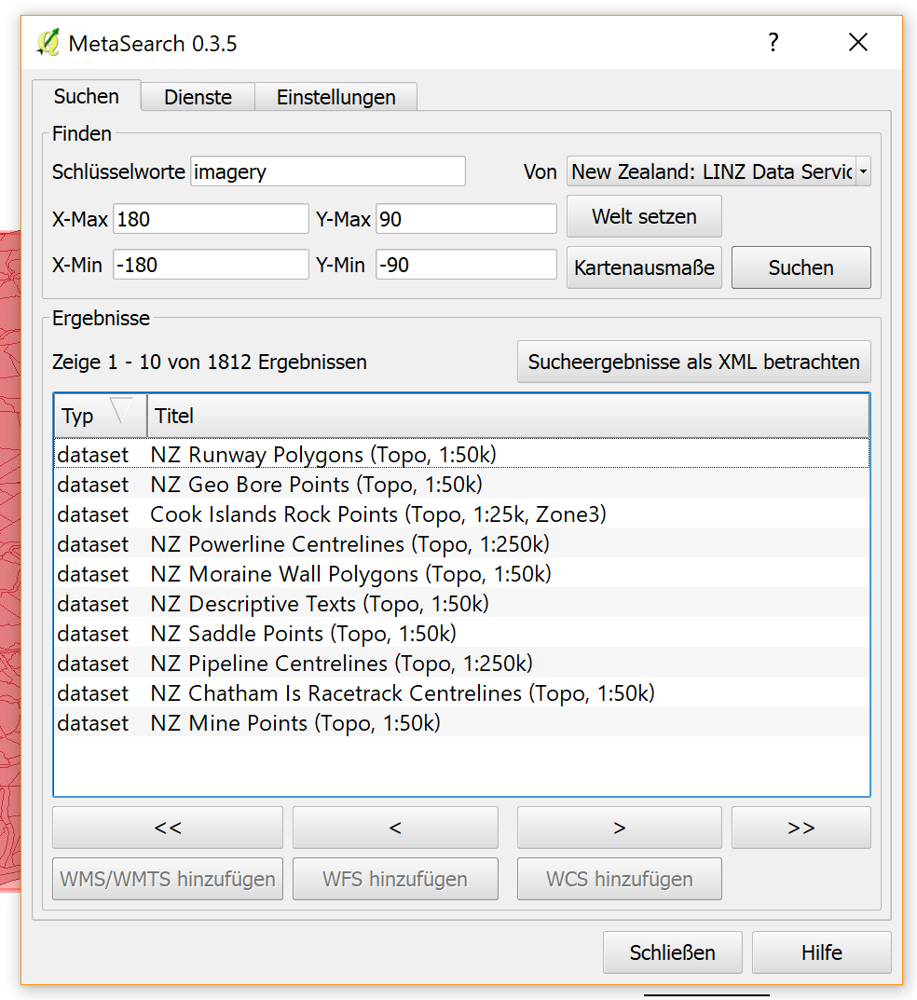

### Geodata - catalogues & geospatial metadata
authors: [@Henry Fock](https://github.com/HenFo/), [@Aysel Tandik](https://github.com/atlanta11950)

* Geodata catalogues & Geospatial metadata
metadata: - Informationen über Daten
        -  beantworten die sechs W-Fragen zu Datenquellen/Datensammlungen
        -  beschreiben Karten, Gis-Dateien, Bilder, ortsbasierte und Datenquellen
catalogues: - Geodaten, Geodienste, Anwendungen können registriert, erfasst, gesucht, gefunden und ausgewählt werden

### SpatioTemporal Asset Catalog [^1]
 Ist eine öffentlich zugängliche Bibliothek zum durchsuchen der verschiedenen Geokataloge. Früher hatten verschiedene Anbieter ihre eigenen Wege um Daten zu beschreiben und verschieden APIs um auf diese Metadaten zuzugreifen. Das führt dazu, dass die Wiederverwendung der Software erschwert worden ist, die Analysearbeit härter und jede Quelle der Daten musste einzelnd ausgewertet werden. Daher wurde die erste STAC-Arbeitsgruppe ins Leben gerufen, um:
-eine Sammlung von Standards für das Beschreiben von Geospatialdaten zu etablieren
-eine Flatfile Katalogstruktur zu definieren, die eine Gruppe von Gegenständen (z.B Bilder) in einem Katalog beschreibt
-um eine RESTful API zum Abfragen von Geospatialdata
  * Suchen von Medatan mit der STAC-API über die sat-API -->  https://sat-api.developmentseed.org/search/stac
  - Ergebnis als GeoJSON 
  - Abfrage ohne Paramater liefert alle Ergebnise aus dem Katalog und gibt aber 
  das erste Ergebnis zurück. 
 
Beispiel (Koordinaten und Assets ausgelassen): 
```json5
{
  "type": "FeatureCollection",
  "properties": {
    "found": 7262899,
    "limit": 1,
    "page": 1
  },
  "features": [
    {
      "type": "Feature",
      "properties": {
        "id": "LC08_L1TP_026009_20150729_20170406_01_T1",
        "c:id": "landsat-8-l1",
        "datetime": "2015-07-29T16:44:13.782Z",
        "eo:cloud_cover": 89,
        "eo:sun_azimuth": 177.64085481,
        "eo:sun_elevation": 36.48367326,
        "landsat:path": 26,
        "landsat:row": 9
      },
      "bbox": [
        -75.29137,
        71.82026,
        -67.5855,
        72.51896
      ],
      "geometry": {
        "type": "Polygon",
        "coordinates": [
          ...
        ]
      },
      "assets": {
        ...
      },
      "links": {
        "index": {
          "href": "http://landsat-pds.s3.amazonaws.com/L8/026/009/LC80260092015210LGN00/index.html"
        },
        "self": {
          "rel": "self",
          "href": "https://sat-api.developmentseed.org/stage/search/stac?id=LC08_L1TP_026009_20150729_20170406_01_T1"
        },
        "collection": {
          "href": "https://sat-api.developmentseed.org/stage/collections/landsat-8-l1/definition"
        }
      }
    }
  ]
}
```

### Software zum schreiben und lesen von Metadaten
* ExifTool
 Ist eine Plattformunabhängige PERL-Bibliothek zum lesen, schreiben und bearbeiten von Metadaten in einem breiten Spektrum von Dateien. Es unterstützt viele verschieden Arten von Metadaten wie EXIF, GPS, IPTC, XMP, JFIF, GeoTIFF, ICC Profile, Photoshop IRB, FlashPix, AFCP und ID3, ebenso wie viele Digitalkameras: Canon, Casio, DJI, FLIR, FujiFilm, GE, GoPro, HP, JVC/Victor, Kodak, Leaf, Minolta/Konica-Minolta, Motorola, Nikon, Nintendo, Olympus/Epson, Panasonic/Leica, Pentax/Asahi, Phase One, Reconyx, Ricoh, Samsung, Sanyo, Sigma/Foveon und Sony.  
* Erstellung eigener Metadaten
 Dies ist möglich mit Hilfe einer Reihe von Metadaten-Editoren. Als Beispiel gibt es den [Metadaten-Editor von INSPIRE](inspire-geoportal.ec.europa.eu/editor/). Dieser stellt eine Reihe von Optionen zur Verfügung, um seine eigenen Metadaten nach OGC-Standard zu erstellen.
* GeoTIFF
 "Georeferenced Tagged Image File Format" ist eine öffentliches Dateiformat und 
 defacto Standard basierend auf dem TIFF Format und wird für Satellitenbilder (Rasterdaten) genutzt.

#### Geospatial metadata außerhalb der GIS-Domäne
* RDF - Resource Description Framework [^2]
 RDF Daten bestehen aus Knoten und den dazugehörigen Attributen/Variablenpaaren. Die Knoten können irgendeine Webquelle sein (wie z.B Seiten, Server, im Allgemeinen alles was man als URI mitgeben kann) oder andere Instanzen von Metadaten. Attribute sind Eigenschaften der Knoten und die Variablen sind atomar (Text Strings, Nummern, usw.) oder andere Quellen. Zusammengefasst erlaubt uns dieser Mechanismus um beschriftete gerichtete Graphen zu bauen. 
  - genutzte Sprache: XML

#### In-situ Messung - Metadaten
*In-situ Messungen sind Messungen die vor Ort durchgeführt werden* [^6]
Zu den In-situ Messungen werden Metadaten gespeichert um das "finden" und "filtern" dieser Daten zu vereinfachen. [^9] 
Beispiele:
1) Messungen werden durch die SDIs von der Regierung der Öffentlichkeit zur Verfügung gestellt 
2) Die entstprechenden Metadaten werden in Katalogen gespeichert


#### Geoaspekte - Geotagging & EXIF Metadaten
* Geotagging [^3]: Speichern der Koordinaten von Breiten- und Längengrad eines Ortes an dem beispielsweise ein Bild aufgenommen wurde. Dazu gibts es drei verschiedene Methoden um die Ortsinformation zu speichern:
  * Direktes-kamereainternes Geotagging: Die Informationen werden direkt bei der Aufnahme in die Exif-Daten geschrieben. Dies ist möglich wenn ein GPS-Empfänger mit der Kamera verbunden ist. Der Vorteil ist, dass die Metadaten nicht nachträglich überarbeitet oder verändert werden müssen. 
  * Manuelles Geotagging: Mit Hilfe eines Programmes können Fotos aus einer Landkarte heraus einem Ort zugeteilt werden. Um dies zu verwirklichen wird die Hilfe einer kartenmaterialverwendenden Software benötigt (beispielsweise Geosetter).
  ->Vorteil: Ein GPS-Epmfang ist bei der Aufnahme nicht nötig. 
  ->Nachteil: Jedes Bild muss einzelnd einem Ort zugewiesen werden. 
  * Indirektes-trackbasiertes Geotagging: Die Aufnahmen werden automatisch durch einen aufgezeichneten GPS-Track(Reiseroute) den Koordinaten zugewiesen. Zusätzlich ist eine Software, GPS-Track und Aufnahmen mit korrekten Uhrzeiten, wann diese aufgenommen wurden, nötig. 
-> Vorteil: Häufig genauer, weil mit GPS-Empfängern gearbeitet wird (präziser als Geotagger)
->Nachteil: Nacharbeit mit Computer ist erforderlich

* Exif-Metadaten [^4]
EXIF = Exchangeable Image File Format
-> Standardformat um verschiedene Metadaten in digitalen Bildern abzuspeichern
-> Formate: JPEG / TIFF / RIFF WAV [^5]
Metadaten: sind Informationen, die vor dem eigentligen Bild vorhanden sind. Diese wären: Name und Typ der Datei, Erstelldatum und Größe, Bildabmessungen und Bittiefe.
Hier wäre ein [Beispiel](https://en.wikipedia.org/wiki/Exif#Example) für Exif-data zu finden.

#### Implementierungen des OGC CSW
OGC CSW = "Open Geospatial Consortium - Catalog Service for the Web" [^7]
Der Katalog Service unterstützt die Fähigkeit um das Publizieren und Suchen von Sammlungen von deskriptiver Information (Metadaten) für Daten, Services und zugehörige Objektinforamtionen zu verwirklichen. 


* Implementierungen:
  * Pycsw [^8]: Serverimplementation, geschrieben in Python
   -> Kataloge mit Datenbeschreibungen (Metadaten) werden im Web in standardisierten Formate durch Standard basierende Werkzeuge über pycsw veröffentlicht 
   -> pycsw wird über ein Apache Web Service aufgesetzt
   -> kann auf Metadaten-Datensätze die in XML-Dateien vorliegen oder auf Datensätze in einer Datenbank zugreifen
  * GeoNetwork [^10]: Metadaten-Informationssystem, geschrieben in Java
   ->Ist eine Katalogapplikation um räumlichreferenzierte Quellen zu verwalten. Es unterstützt leistungsstark die Metadatanbearbeitung und die Suchfunktionen als ein interaktiver Web map viewer.
* Requests [^11]:
    * _GetCapabilities_: Gibt allgemeine Informationen über den Geodatenkatolog z.B. enthaltende Datentypen und die Größe des Kataloges im XML-Format
   * _DescribeRecord_: Beschreibt den gesuchten Datensatz
   * _GetRecordById_: Gibt die Metadaten zum per ID gesuchten Datensatz 
   * _GetRecords_: Gibt anhand von Filtern die gefundenen Daten zurück
   * _Harvest_: Indirektes bearbeiten, löschen und hinzufügen von externen Metadaten
   * _Transaction_: Direktes bearbeiten, löschen und hinzufügen von lokalen Metadaten
   
 * Responses: Jede Request gibt eine XML-Datei Response zurück, diese beinhaltet die angefordeteten Rückgaben. Bei den Post-Requests "Harvest" und "Transaction" werden die jeweiligen Änderungen im Katalog aufgelistet. 
 
 * Metadaten - Format [^12]
   * Die Daten beinhalten Dublin Core, ISO 19139 oder FGDC metadata, enkodiert in UTF-8 Buchstaben
   * Titel, Format, Typ (z.B. Dataset, DatasetCollection oder Service), BoundingBox (für ein bestimmten Bereich werden Daten eingebunden in Längen- und Breitengrade), referenziertes Koordinatensystem und die Beziehung (ein Link zu anderen Metadaten).
 
 ### Praxix - Beispiel QGIS
 * Installation von pycsw: Über Docker Befehl in der Konsole "docker run -p 8000:8000 geopython/pycsw"
 * Schließen von Python: "Docker ps" -> Kopieren der _ID_ -> "Docker stop _ID_"
 
 Nachdem Installieren des Plugins "Metasearch" kann man vordefinierte Katalogdienste oder aber auch eigene Kataloge hinzufügen. Zum Hinzufügen von eigenen muss man die URL und einen Namen angeben. Wir haben versucht die OGC WSC Implementierung "pycsw" hinzuzufügen, jedoch scheint sich einiges verändert zu haben weshalb die offizielen Tutorials nicht mehr der Realität entsprechen. Sollte man es aber es schaffen diese einzubinden, kann man die Dienstinformationen abfragen. Nun kann man im Fenster "Suchen" sein Katalog auswählen und nach einem Schlüsselwort (z. B. Imagery) suchen. Man bekommt eine Liste an Datensätzen, die auf diese Suche zutreffen. Die Datensätze können nun als WMS, WMTS oder WFS seiner Karte in QGIS hinzufügen. 
 
 
[^1]: https://www.developmentseed.org/blog/2018/07/23/stac-and-sat-api/
[^2]: https://www.w3.org/TR/NOTE-rdf-simple-intro
[^3]: http://gps-camera.eu/wissen/Was-ist-Geotagging-Welche-Moeglichkeiten-gibt-es
[^4]: https://www.prophoto-online.de/digitalfotografie/exif-daten-10010057
[^5]: https://en.wikipedia.org/wiki/Exif
[^6]: https://de.wikipedia.org/wiki/In_situ
[^7]: http://www.opengeospatial.org/standards/cat
[^8]: https://live.osgeo.org/de/overview/pycsw_overview.html
[^9]: http://www.coastalwiki.org/wiki/In_situ
[^10]: https://geonetwork-opensource.org
[^11]: https://geonetwork-opensource.org/manuals/2.10.4/eng/developer/xml_services/csw_services.html
[^12]: https://en.wikipedia.org/wiki/Catalog_Service_for_the_Web

### Quellen
* https://www.developmentseed.org/blog/2018/07/23/stac-and-sat-api/
* https://www.w3.org/TR/NOTE-rdf-simple-intro
* http://gps-camera.eu/wissen/Was-ist-Geotagging-Welche-Moeglichkeiten-gibt-es
* https://www.prophoto-online.de/digitalfotografie/exif-daten-10010057
* https://en.wikipedia.org/wiki/Exif
* https://de.wikipedia.org/wiki/In_situ
* http://www.opengeospatial.org/standards/cat
* https://live.osgeo.org/de/overview/pycsw_overview.html
* http://www.coastalwiki.org/wiki/In_situ
* https://geonetwork-opensource.org
* https://geonetwork-opensource.org/manuals/2.10.4/eng/developer/xml_services/csw_services.html
* https://en.wikipedia.org/wiki/Catalog_Service_for_the_Web