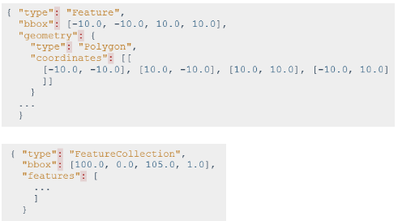
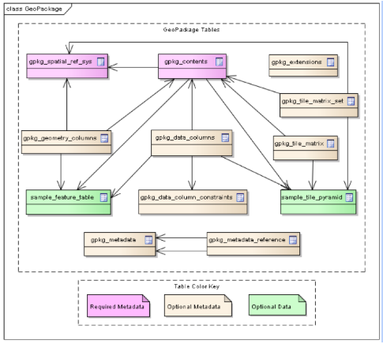

# Geosoftware II - Daniel Nüst und Prof. Dr. Edzer Pebesma
# Wintersemester 2018 / 2019
# Handout Geospatial Data Formats and Libraries

**Autoren:** Hilal Karakoc [@hilal98](https://github.com/hilal98), Anika Graupner [@Anika2](https://github.com/Anika2) 

## Inhaltsverzeichnis

- [1. Einleitung ](#1-einleitung--a-name--1----a-)
- [2. Geospatial Data Formats](#2-geospatial-data-formats)
  * [2.1 Wichtige Vektordatenformate](#21-wichtige-vektordatenformate)
    + [2.1.1 DWG (drawing) | .dwg](#211-dwg--drawing----dwg)
    + [2.1.2 DXF (Drawing Interchange Format) | .dxf](#212-dxf--drawing-interchange-format----dxf)
    + [2.1.3 GeoJSON | .geojson](#213-geojson---geojson)
    + [2.1.4 KML (Keyhole Markup Language) und KMZ | .kml, .kmz](#214-kml--keyhole-markup-language--und-kmz---kml--kmz)
    + [2.1.5 GML (Geography Markup Language) | .gml](#215-gml--geography-markup-language----gml)
    + [2.1.6 SHP (Shapefile)](#216-shp--shapefile-)
    + [2.1.7 GPKG  (GeoPackage) | .gpkg](#217-gpkg---geopackage----gpkg)
    + [2.1.8 GeoJSON-LD ((Geo) JavaScript Object Notation for Linked Data)](#218-geojson-ld---geo--javascript-object-notation-for-linked-data-)
    + [2.1.9 LAS (LASer) | .las](#219-las--laser----las)
  * [2.2 Wichtige Rasterdatenformate:](#22-wichtige-rasterdatenformate-)
    + [2.2.1 JPEG (Joint Photographic Experts Group) | .jpg](#221-jpeg--joint-photographic-experts-group----jpg)
    + [2.2.2 GIF (Graphic Interchange Format) | .gif](#222-gif--graphic-interchange-format----gif)
    + [2.2.3 (Geo)TIFF (Tagged Image File Format) | .tiff / .tif und Cloud Optimized GeoTIFF](#223--geo-tiff--tagged-image-file-format----tiff---tif-und-cloud-optimized-geotiff)
    + [2.2.4 BMP (Windows Bitmap) | .bmp](#224-bmp--windows-bitmap----bmp)
    + [2.2.5 NetCDF (Network Common Data Format)](#225-netcdf--network-common-data-format-)
    + [2.2.6 JPEG2000](#226-JPEG2000)
- [3. Geospatial Libraries](#3-geospatial-libraries)
  * [3.1 Was ist eine Programmbibliothek](#31-was-ist-eine-programmbibliothek)
  * [3.2 Programmbibliotheken für Geodaten und -anwendungen](#32-programmbibliotheken-f-r-geodaten-und--anwendungen)
    + [3.2.1 GDAL / OGR (Geospatial Data Abstraction Library / OpenGIS Simple Feature Reference Implementation)](#321-gdal---ogr--geospatial-data-abstraction-library---opengis-simple-feature-reference-implementation-)
    + [3.2.2 GeoTools](#322-geotools)
    + [3.2.3 Proj4](#323-proj4)
    + [3.2.4 libLAS](#324-liblas)
    + [3.2.5 GEOS (Geometry Engine Open Source)](#325-geos--geometry-engine-open-source-)
    + [3.2.6 JTS Topology Suite (JTS)](#326-jts-topology-suite--jts-)
- [4. Zusammenfassung](#4-zusammenfassung)
- [Quellenangaben](#quellenangaben)

<small><i><a href='http://ecotrust-canada.github.io/markdown-toc/'>Table of contents generated with markdown-toc</a></i></small>

 
## 1. Einleitung 
Unser Thema “Geospatial Data Formats and Libraries” behandelt unter anderem verschiedene Datenformate zum Austausch und zur Visualisierung von Geodaten, diese sind unterteilt in Vektordatenformate und Rasterdatenformate. Einige der Formate dürften schon bekannt sein aus vergangenen Kursen und Vorlesungen. 
Aufgrund der Menge der Informationen sind an einigen Stellen Links zu empfehlenswerten Webseiten angegeben zur persönlichen Vertiefung, falls nötig. 
Weiterhin haben wir in unserem Handout sechs Programmbibliotheken aufgeführt und deren Funktionen erklärt, allerdings unterschiedlich ausführlich. An diesen wird auch deutlich, warum Geodatenformate und Bibliotheken zusammen in einer Präsentation vorgestellt werden.

## 2. Geospatial Data Formats
Listen mit verschiedenen Formaten (Vektor und Raster):

*https://de.wikipedia.org/wiki/Grafikformat*

### 2.1 Wichtige Vektordatenformate
Allgemeine Informationen zu Vektordaten:

*https://www.spektrum.de/lexikon/geographie/vektordaten/8542*

#### 2.1.1 DWG (drawing) | .dwg

*Spezifikation:*   
https://www.scan2cad.com/dwg/file-spec/

- Konstruktions-Datenformat und Grafik-Technologie von Autodesk bzw. Namensanhang für zwei- und dreidimensionale Zeichnungsdateien
- enthält z.B. Entwurfsdaten, Geometriedaten, Bilder, Karten (Designdaten und Metadaten)
- binäres Dateiformat
	- nicht vollständig von Menschen lesbar
	- Binärcodierung basiert auf den vom Benutzer bereitgestellten Informationen
- beim Konvertieren von DWG nach DXF gehen Informationen verloren 

#### 2.1.2 DXF (Drawing Interchange Format) | .dxf

*Spezifikation:*   
https://www.scan2cad.com/dxf/file-specification/

- Austauschformat für CAD-Daten 
- von Autodesk entwickelt 
- enthält 2D-Daten wie Linien, Kreise und Splines oder auch 3D-Daten 
- ASCII Format
	- lesbar (z.B. einfach mit einem normalen Texteditor)
	- erleichtert den Datenaustausch

##### Aufbau:

Kopf:

- Definition der Arbeitsumgebung 
	- Festlegungen über die Assoziativität von Bemaßungen
	- Attribute für Maßketten
	- Einstellungen für Rundungen
	- globale Parameter für Schraffuren etc.
	- Stiftbelegungen der Ausgabegeräte
	- Position der lokalen und globalen Koordinatensysteme

Tabelle:

- enthält Informationen über Darstellung verschiedener Elemente wie Farben, Strichstärken usw., die Darstellungen am Bildschirm, Papierbereiche und Ähnliches

Blöcke:

- die Blockdefinitionen enthalten Informationen über Elemente, die zu Blöcken zusammengefasst sind. Neben Schraffuren oder Maßketten kann dies auch frei definierte Geometrieelemente beinhalten.

Geometrie:

- Im geometrischen Teil werden Linien, Polygone, Kreise, Kreisbogen, Texte und alle anderen Grundelemente mit verschiedenen Attributen wie Ebenen, Farbe, Strichstärke oder Linientyp gespeichert. Einige Programme importieren nur diesen Abschnitt, wodurch viele Informationen verloren gehen, Probleme jedoch weitgehend vermieden werden. 

       
*(Quelle: https://www.scan2cad.com/wp-content/uploads/2016/01/dxf-file-format-group-code-sections-file-structure.jpg)*

       
*(Quelle: http://www.ellenfinkelstein.com/autocadtips/images/acadtips_dxf_format_edit_drawings-2.png)*

#### 2.1.3 GeoJSON | .geojson

*Spezifikation:*    
https://tools.ietf.org/html/rfc7946

- Geodatenaustauschformat basierend auf “JavaScript Object Notation” (JSON)
- zum Kodieren geographischer Datenstrukturen 

##### Aufbau:
     
*(Quelle: https://www.scan2cad.com/dxf/technical-dissection/)*

- die GeoJSON Datenstruktur ist immer ein Objekt
	- besteht aus einer Sammlung von Name/Wert-Paaren (Members)
	- Name: ist immer ein String 
	- Werte: String, Zahl, Objekt, Array, Literale: true, false, null
- Features: beinhalten ein Geometrieobjekt und zusätzliche Eigenschaften 
- Feature Collection: repräsentiert eine Liste aus Featuren 

##### Geometrien und Coordinate-Members:

Point:

- eine einzelne Position 

MultiPoint:

- ein Array aus Positionen

Linestring:

- ein Array aus zwei oder mehr Positionen 
- geschlossener LineString: vier oder mehr Positionen, wobei die erste und die letzte Position gleich sind 

MultiLineString:

- ein Array aus LineString Koordinaten Arrays

Polygon:

- ein Array aus LinearRing Koordinaten Arrays 
- bei Polygonen mit mehreren Ringen muss der erste der äußere Ring sein und alle anderen müssen innere Ringe oder Löcher sein

MultiPolygon:

- Array aus Polygon Koordinaten Arrays 

Geometry Collection:

- ein Geometrieobjekt, das eine Sammlung aus Geometrieobjekten darstellt 
- muss ein “Member” mit dem Namen “geometries” enthalten 
- jedes Element im Array ist ein GeoJSON Geometrieobjekt

##### Koordinaten Referenzsystem Objekte:

- das CRS eines GeoJSON Objekts wird durch dein crs-Member bestimmt 
	- wenn keins vorhanden, crs-Member von einem der übergeordneten Objekten
		- ansonsten gilt Standard für GeoJSON Objekt (geographisches Koordinatenreferenzsystem, das das WGS84 Datum und Längen- und Breitengradeinheiten der Dezimalgrade verwendet)
	- sollte sich auf der obersten Ebene in einer Hierarchie befinden 
	- darf die Koordinatenordnung nicht ändern 
	- erzeugt ein Koordinatenreferenzsystem anhand seines Namens 
		- Wert des Members “name” muss eine Zeichenfolge sein, die ein CRS angibt 
			- urn: ogc: def: crs: OGC: 1.3: CRS84" werden älteren Bezeichnern wie "EPSG: 4326" vorgezogen

        
*(Quelle: http://geojson.org/geojson-spec.html)*

oder verlinkt:

      
*(Quelle: http://geojson.org/geojson-spec.html)*
 
    
*(Quelle: http://geojson.org/geojson-spec.html)*

##### Bounding Boxes:

- Informationen zum Koordinatenbereich für Geometrien 
- Element namens “bbox” mit dem Wert 2*n-Array, wobei n die Anzahl der in den enthaltenen Geometrien dargestellten Dimensionen ist, wobei die niedrigsten Werte für alle Achsen gefolgt von den höchsten Werten angezeigt werden

    
*(Quelle: http://geojson.org/geojson-spec.html)*

#### 2.1.4 KML (Keyhole Markup Language) und KMZ | .kml, .kmz

*Spezifikation:*    
http://www.opengeospatial.org/standards/kml/

- KML ist eine Auszeichnungssprache die geographische Informationen sowohl in Vektorform als auch in Rasterform enthält
- XML Syntax 
- Format wurde ursprünglich von Satellitenbildfirma Keyhole Corp. entwickelt, 2004 aber von Google übernommen 
- mittlerweile vom OGC (Open Geospatial Consortium) als Standard anerkannt 
- Dateiformat von Google Earth und Google Maps 

- .kmz Dateiendung für komprimierte KML Dateien
	- ZIP-Archive, welche die eingebetteten Daten, wie Texturen und 3D-Modelle als separate Dateien beinhalten

##### (Freeware) Programme zum Öffnen von Keyhole Markup Language Format Dateien:

MacOS:

- Google Earth
- Blender
-GRASS 

Windows:

- Google Earth
- Blender
- ESRI ArcGIS Explorer Desktop
- LizardTech GeoViewer

Linux:

- Google Earth
- Blender
- GRASS 

##### Aufbau:

- Basis: XML (Extensible Markup Language)
	- bekannt aus SII (WS 17/18)
	- sinnvolle Speicherung hierarchischer Daten und ihrer Struktur 
	- semantische Ebene und syntaktische Ebene
	- Case Sensitive 

     
*(Quelle: https://www.gislounge.com/look-kml-open-standard-represent-visualize-spatia
l-information/)*

- beginnt wie alle XML-Dateien mit den XML header Informationen 
- danach KML root element tag (kml 2.2 namespace specification) 
- eine KML Datei kann nur ein <kml> Element enthalten, alle andere Informationen eingeschlossen in diesem Tag
- Placemark: 
	- zentrales Element
	- jedes geometrische Objekt, das auf der Karte zu sehen ist, gehört zu einer Placemark
	- enthält folgende Objekte:
		- name: wie ein Label für die Placemark
		- description 
		- geometry: Point, LineString, LinearRing etc. 

##### Zu empfehlendes KML Tutorial:
https://developers.google.com/kml/documentation/kml_tut#placemarks

#### 2.1.5 GML (Geography Markup Language) | .gml

*Spezifikation:*      
http://www.opengeospatial.org/standards/gml

- vom OGC definierte 3D-Vektorbeschreibungssprache 
- offene Schnittstelle zum GIS 
- Format dient nur zum Datenaustausch und der Datensicherung 
- basiert auch auf XML
	- einer der XML-Standards für die GeoWeb-Infrastruktur, mit deren Hilfe internetfähige Geräte Zugriff auf geobezogene Daten  erhalten 
- wird auch in der Normbasierten Austauschschnittstelle (NAS) angewendet

##### Unterschied GML und KML:

- GML ist geeignet, den Inhalt geobezogener Dokumente zu erschließen, indem es ein Spektrum von Anwendungsobjekten und deren Eigenschaften (wie Brücken, Straßen, Bojen…) beschreibt
- KML steht für die Visualisierung geographischer Informationen und kann verwendet werden, um GML-Inhalte darzustellen 
- GML kann aber auch so erweitert werden, dass es Inhalte in der Art von KML darstellen kann 

##### Aufbau:

      
*(Quelle: https://gdal.org/1.11/ogr/drv_gml.html)*

#### 2.1.6 SHP (Shapefile)

*Spezifikation:*      
https://www.esri.com/library/whitepapers/pdfs/shapefile.pdf

- verbreitetes Format zur Speicherung räumlicher Daten 
	- geographische Position
	- Attributinformationen 
- besteht aus mindestens drei einzelnen Dateien:
	- .shp - enthält die Geometriedaten (Punkte, Linien, Polygone Multi-Punkte)
	- .dbf - enthält die Sachdaten / Attribute 
	- .shx - dient als Index zur Verknüpfung 
	- optionale Dateien 
- in einem Shapefile können jeweils nur Elemente eines Typs enthalten sein

    
*(Quelle: http://desktop.arcgis.com/de/arcmap/10.3/manage-
data/shapefiles/what-is-a-shapefile.htm)*

##### Aufbau:

- die Größe der Shp- und DBF-Dateien darf 2 GB nicht überschreiten 
- das Attribut-Datenbankformat (.dbf) beruht auf einem früheren dBase-Standard
	- eingeschränkte Unterstützung für Unicode-Feldnamen 
	- maximale Länge der Feldnamen: 10 Zeichen 
	- maximale Anzahl der Felder: 255
	- Zulässige Feldtypen sind Floating Point (13 Zeichen), Ganzzahl / Integer, Datum ohne Zeitspeicherung (8 Zeichen) und Text (254 Zeichen
	- Fließkommazahlen können Rundungsfehler enthalten, da sie als Text gespeichert werden

    
*(Quelle: http://desktop.arcgis.com/de/arcmap/10.3/manage-
data/shapefiles/what-is-a-shapefile.htm)*

- Die SHP-Datei mit den Koordinaten. Diese werden im Binärformat gespeichert, können jedoch in einem für den Menschen lesbaren Text angezeigt werden. Die SHP-Datei hat auch eine Kopfzeile für die gesamte Schicht und eine Kopfzeile für jeden Datensatz.

     
*(Quelle: http://desktop.arcgis.com/de/arcmap/10.3/manage-
data/shapefiles/what-is-a-shapefile.htm)*

- Die DBF-Datei, eine dBase-Datei mit der Datenbanktabelle, die Datensatzattribute enthält. Dies führt implizit zu den SHP- und SHX-Dateien durch die implizite Datensatznummer in der DBF-Datei.

     
*(Quelle: http://desktop.arcgis.com/de/arcmap/10.3/manage-
data/shapefiles/what-is-a-shapefile.htm)*

- Die SHX Datei, ein Index. Diese werden in Binärformat gespeichert. 
	- Header, identisch mit dem in der SHP-Datei
	- Bounding Box für jeden Datensatz 
	- der Offset zum Anfang eines Datensatzes, seine Länge und die Anzahl der Teile und Punkte 

#### 2.1.7 GPKG  (GeoPackage) | .gpkg

*Spezifikation:*      
http://www.geopackage.org/spec/

- offener, nicht proprietärer, plattformunabhängiger, auf bereits existierenden Standards aufbauender Standard, um Geodaten (Vektor- und Rasterdaten) in einer Datei zu speichern
- Standard definiert die Art und Weise, in der Geodaten in einer SQLite-Datenbank abgelegt werden
- OGC Entwurf Januar 2013, Erstveröffentlichung: 12. Februar 2014
- Speicherung von Vektor- und Rasterdaten im SQLite DB-Fileformat 
- GeoPackage = SQLite container
- GeoPackage Encoding Standard = regelt Regeln und Anforderungen von Inhalten, die in einem Container gespeichert sind 
- GeoPackage Standard = Definiert das Schema für ein GeoPackage, einschließlich Tabellendefinitionen, Integritätsaussagen, Formatbeschränkungen und Inhaltsbeschränkungen. Der erforderliche und unterstützte Inhalt eines GeoPackages ist im Standard vollständig definiert.
- Vektoren werden im SpatiaLite-Format und Rasterdaten wie MBTiles gespeichert 
	- SpatialLite-Format: “freies, OpenGIS kompatibles geografisches Informationssystem welches die Datei-basierte Datenbank SQLite um geografische Objekte und Funktionen erweitert” (https://de.wikipedia.org/wiki/SpatiaLite, 08.09.2018)
	- MBTiles: “file format for storing tilesets. It’s designed so that you can package the potentially thousands of files that make up a tileset and move them around” (https://www.mapbox.com/help/define-mbtiles/”, 08.09.2018)
- GeoPackage unterstützt nur ein Geometrieattribut je Featureklasse (Tabelle)

     
*(Quelle: http://www.geopackage.org/spec/)*

Eine Tabelle mit dem Namen gpkg_spatial_ref_sys ist die erste Komponente des Standard-SQL-Schemas für einfache Funktionen. Die darin enthaltenen Koordinatenreferenzsystem-Definitionen werden in den Tabellen GeoPackage gpkg_contents und gpkg_geometry_columns referenziert, um die Vektor- und Raster(Kachel-)daten in Benutzertabellen mit Standorten auf der Erde in Beziehung zu setzen.

##### Weitere Informationen.

http://www.geopackage.org/spec/ 

#### 2.1.8 GeoJSON-LD ((Geo) JavaScript Object Notation for Linked Data)

*Spezifikation:*    
https://json-ld.org/spec/latest/      
http://geojson.org/geojson-ld/

- basiert auf JSON-LD

##### JSON-LD:

- Konzept zur Nutzung von verlinkten Daten 
- Daten werden hinzugefügt, um diese zwischen Webanwendungen und Webservices auszutauschen und automatisiert zu verarbeiten 
- grundlegende Idee: Kontext (@context)
	- Übertragung von Daten und Datentypen in eine andere Syntax
- Web 2.0:
	- Datenaustausch zwischen Websites und Browser erfolgt vor allem über eine Mensch-Maschine-Kommunikation und damit verbundene Protokolle wie HTTP
		- dabei verwendeten Daten zwar durch Auszeichnungssprachen (zum Beispiel HTML) für die Darstellung strukturiert, liegen aber nicht in einem Format vor, das von jeglichen Computern gelesen werden kann
			- es können nicht beliebige Daten miteinander verlinkt oder von unterschiedlichen Computern verarbeitet werden
- JSON-LD: Kommunikation zwischen Maschinen
- Web 3.0 (semantische Web):
	- auf verlinkte Daten angewiesen, da zwei oder mehr Webanwendungen andernfalls nicht miteinander kommunizieren könnten
	- Syntax JSON-LD: so konzipiert, dass verschiedene Daten eine Struktur erhalten, die den Austausch von Informationen zwischen Maschinen ermöglicht. Dies wird einerseits erreicht durch JSON als grundlegendes Format für den Datenaustausch zwischen Anwendungen, andererseits durch Kontexte (@context) und eindeutige Bezeichner (@id), um Daten miteinander zu verlinken und transportierbar zu machen

**Beispiele:**

	{
		"@context": "https://json-ld.org/contexts/person.jsonld",
 	    "@id": "http://dbpedia.org/resource/John_Lennon",
 	    "name": "John Lennon",
  		"born": "1940-10-09",
  		"spouse": "http://dbpedia.org/resource/Cynthia_Lennon"
	}

##### GeoJSON-LD:

Namespace:

https://purl.org/geojson/vocab#

Context:

http://geojson.org/geojson-ld/geojson-context.jsonld

Beispiel:

	[
  		{
    		"https://purl.org/geojson/vocab#geometry": [
      			{
        			"https://purl.org/geojson/vocab#coordinates": [
          				{
            				"@list": [
              					{
                					"@value": 0
              					},
              					{
                					"@value": 0
              					}
            				]
          				}
        			],
        			"@type": [
          				"https://purl.org/geojson/vocab#Point"
        			]
      			}
    		],
    		"@id": "http://example.com/features/1",
    		"https://purl.org/geojson/vocab#properties": [
      			{
        			"http://purl.org/dc/terms/description": [
          				{
            				"@value": "A fictional island in the Gulf of Guinea"
          				}
        			],
        			"http://purl.org/dc/terms/title": [
          				{
            				"@value": "Null Island"
          				}
        			]
      			}
    		],
    		"@type": [
      			"https://purl.org/geojson/vocab#Feature"
    		]
  		}
	]

#### 2.1.9 LAS (LASer) | .las

*Spezifikation:*    
https://www.asprs.org/wp-content/uploads/2010/12/LAS_1_4_r13.pdf    

- Dateiformat zum Austausch von 3D-Punktwolken 
- primär zum Austausch von Lidar Punktwolkendaten 
	- Lidar verwendet ultraviolettes, sichtbares oder nahinfrarotes Licht zur Abbildung von Objekten
		- Instrumente (z.B. Laserscanner oder Kameras) die an Flugzeugen oder Satelliten angebracht sind

##### Aufbau:

    
*(Quelle: http://www.kaudel.de/projekte/GIFundPNG.pdf/)*

Header:

- allgemeine Informationen über die gesamte Fluglinie, z.B. maximaler Scanwinkel

Varable Length Records:

- waveform packet descriptors, enthalten Informationen darüber, wie die waveform packets (i.e. an ID, the number of wave samples and the size of each intensity in bits) zu lesen sind

Point Data Records:

- diskrete Punkte
	- haben einen Ort, eine Intensität und optional einen Zeiger auf ein waveform packet
	- waveform packet: Liste von Intensitäten, die entweder intern im Abschnitt für die erweiterten Variablenlängensätze der LAS-Datei oder in einer externen .WVS-Datei gespeichert werden

### 2.2 Wichtige Rasterdatenformate:    
**Allgemeine Informationen zu Rasterdaten:**

https://www.spektrum.de/lexikon/geographie/rasterdaten/6416

#### 2.2.1 JPEG (Joint Photographic Experts Group) | .jpg    

*Spezifikation:*      
https://www.w3.org/Graphics/JPEG/jfif3.pdf

- Standard im Internet für den Austausch von Fotos
- sehr geringer Speicherplatzbedarf
- Komprimierung: durch mathematische Verfahren werden Datenmengen beim Erstellen einer JPEG reduziert und beim Öffnen wieder hergestellt
- Ohne Komprimierung: jedes Raster drei Byte (für rot,blau,grün je ein Byte)

##### JPEG-Codierung:

Farbraumkonvertierung:

- wandelt das Bild in eine Darstellung mit einem Wert für Helligkeit (Luminanz) und zwei Werten für die Farbe (Chrominanz) um
- Reduzierung der Datenmenge möglich: da menschliches Auge Helligkeitsunterschiede besser wahrnimmt können Farbsignale in geringer Auflösung gespeichert werden 

Teilung in Blöcke:

- Teilung in 8x8 Pixel
- kleine Quadrate entstehen bei schlechter Qualität

Eigentliche Komprimierung:

- mathematisches Verfahren um die Bilddaten in einer kleine Datenmenge umrechnet und wieder rückgängig macht
- Verluste bei jeder Komprimierung/Dekomprimierung 

#### 2.2.2 GIF (Graphic Interchange Format) | .gif

*Spezifikation:*      
https://www.w3.org/Graphics/GIF/spec-gif89a.txt

- geeignet für Bitmap-Bilder (.bmp) und Animationen
- jeder Browser kann Dateien mit der Endung .gif öffnen
- gut geeignet für einheitliche Farbflächen (z.B. Logos, Banner)
- unterstützt nur 256 Farben
- sehr kleine Dateien

##### Programme mit denen man Gif-Dateien öffnen kann:

MacOS:

- Apple Vorschau
- Google Picasa
- GIMP
- XnView

Windows:

- Microsoft Paint
- Google Picasa
- GIF-X
- IrfanView

Linux:

- Google Picasa
- XnView
- digiKam
- GIMP

##### Aufbau:

     
*(Quelle: http://files.dnb.de/nestor/kurzartikel/thema_06-TIFF.pdf)*

Header:

- Dateikopf
- GIF-Signatur, Screen Descriptor, Global Color Map (optional)
- allgemeine Informationen zur Grafik
- beginnt mit der Signatur: ASCII-Zeichen: GIF87a oder GIF89a (gibt die Version an)
- Screen Descriptor: Angaben zur Höhe und Breite in Pixel 
- globale Farbtabelle: RGB werden als 24 Bit-Farbwerte angegeben

Bilddatenblock:

- Angaben zu einem Einzelbild
- Image Descriptor, Local Color Map (optional), Image Data 
- Image Descriptor: beginnt mit dem Image Separator (1 Byte)
- Angaben zu Höhe, Breite, Einzug des Einzelbildes
- lokale Farbtabelle: ersetzt globale Farbtabelle

Erweiterungsblock:

- nur verfügbar in Version 89a
- 4 Blöcke: Plain Text Extension (ASCII Test), Comment Extension (Kommentare z.B.: Autor), Graphic Control Extension (z.b: Anwendungsgeschwindigkeit), Application Extension (eigene Blöcke)

Terminator:

- gibt das Ende der Datei an
- besteht aus hexadezimal Wert “3B” 

#### 2.2.3 (Geo)TIFF (Tagged Image File Format) | .tiff / .tif und Cloud Optimized GeoTIFF

*Spezifikation:*      
https://cdn.earthdata.nasa.gov/conduit/upload/6852/geotiff-1.8.1-1995-10-31.pdf

- Hauptformat für gerasterte Fotos
- Standardformat für Druckproduktionen
- geeignet für Datenaustausch
- geeignet für Bilddatenspeicherung und Farbprofile und -separation
- besteht aus Datenfeldern (Tags), die bestimmte Eigenschaften eines Bildes zeigen
- Nachteil: sehr große Dateigrößen

##### Aufbau:

     
*(Quelle: http://files.dnb.de/nestor/kurzartikel/thema_06-TIFF.pdf)*

Header:

- zwei MagicBytes “ II ” (MM)
- Identifikation der Datei
- zwei Bytes, Kodierung der Zahl 42 in mögliche Byte-Reihenfolgen

Offset (Position in der Datei) auf Image File Directory (IFD):

- Kodierung auf 4 Bytes
- Folge: maximale Dateigröße von 4GB
- IFD:
	- Anzahl kodierter Tags (2 Byte)
	- Array dieser Tags
	- entweder: neuer Offset-Eintrag (nächstes IFD)
	- oder: Wert Null (Ende der Datei)
- Tags:
	- 12 Bytes groß
	- zwei Bytes für Bezeichnung 
	- zwei Bytes für Datentype
	- vier Bytes für Anzahl der Werte
	- vier Bytes für Anweisung zum nächsten Offset

##### GeoTIFF:

- enthält Informationen über Koordinaten 
- Projektion in Kartenbildern 
- Luftaufnahmen
- wird auch bei der NASA benutzt

#### 2.2.4 BMP (Windows Bitmap) | .bmp

*Spezifikation:*      
http://www.dragonwins.com/domains/getteched/bmp/bmpfileformat.htm

- “device independent bitmap” (DIP)
- geräteunabhängige Grafik
- entwickelt für Microsoft Windows und OS/2
- Grafikdateien entweder unkomprimiert oder schwache RLE-Algorithmus komprimiert
- sehr große Dateien
- einfacher Aufbau
- S/W-Darstellungen, Graustufen, Farbdarstellungen möglich 
- RGB haben jeweils 16 Bit
- Bilder mit aneinander gereihten Pixeln

##### Aufbau:

- Header:
	- File-Header (14 Byte) 
		- Identifizierung und Dateigröße
	- Bitmap-Header (108 Byte) 
		- Grafikgröße; Höhe und Breite
		- Anzahl Farbpaletten
		- Farbtiefe
		- Kompression
		- benutzte Farben
	- Farbpalette
	- Bitmap-Daten
		- Farbwerte für jedes einzelne Pixel

##### Programme mit denen man Gif-Dateien öffnen kann:

MacOS:

- Apple Vorschau
- Google Picasa
- GIMP
- XnView
- Paintbrush

Windows:

- Microsoft Paint
- Google Picasa
- GIF-X
- IrfanView
- Adobe

Linux:

- Google Picasa
- XnView
- digiKam
- GIMP
- Krita

#### 2.2.5 NetCDF (Network Common Data Format)

*Spezifikation:*      
https://www.unidata.ucar.edu/software/netcdf/docs/file_format_specifications.html

- Dateiformat für mehrdimensionale wissenschaftliche Daten
	- z.B. Temperatur, Feuchtigkeit, Druck, Windgeschwindigkeit, Windrichtung
- Selbstschreibend
- übertragbar, plattformübergreifend
- skalierbar: Teilmengen können geöffnet werden ohne die ganze Datei für lesen

##### Datei-Inhalt:

- Header mit Metadaten:
	- Liste mit Dimensionen (Name und Länge),
	- Lister der in der Datei enthaltenen Variablen (Name, Typ und Dimension(en)),
	- variablenbezogene Attribute (long_name, units etc.), und 
	- globale Attribute (title, history etc.)

Anmerkung: bei der Vergabe der Namen für die Attribute und Variablen sollten folgende Standards eingehalten werden: NetCDF Climate and Forecast (CF) Metadata Convention und CF Standard Name Table

- Daten der in der Datei abgelegten Variablen:     
	- (optional) Daten der Koordinaten-Variablen,
	- (optional) Daten der Variablen, für die nur ein Datenrecord in der Datei vorhanden ist
	- (optional) Daten der Record-Variablen (mit einer unbegrenzten Dimension, z.B. time), die beliebig oft vorhanden sein können

#### 2.2.6 JPEG2000

*Spezifikation:*     
https://jpeg.org/jpeg2000/

- Herausgeber: Joint Photographic Expert Group 
- Endungen: .jp2, .jpg2 u.a.
- ermöglicht verlustfreie und verlustbehaftete Komprimierung 
- Bilddaten können eine Reihe von Metadaten aufnehmen, welche das Verwalten und Auffinden der Bilder erleichtern 

##### Vorteile zu JPEG:

- bessere Komprimierungsrate bei gegebener Qualität
- mehr als 8/12 Bits pro Farbkanal möglich 
- bestimmte Bildregionen von Interesse (ROI = Region of Interest) können in höherer Qualität komprimiert und dekomprimiert werden 
- bis zu 256 Kanäle
- Raum für beliebige Metadaten in der Extensible Markup Language 
- Alphakanäle zur Darstellung von Transparenz 

##### Nachteile zu JPEG:

- JPEG2000 inkompatibel zu JPEG 
- Alle Erweiterungen von JPEG-2000-Dateiformaten, die über den reinen Bilddatenstrom hinausgehen (wie zum Beispiel Formate der Metadaten, Farbraumdaten), sind nicht gemeinfrei. Selbst für den Bilddatenstrom garantiert das JPEG-2000-Konsortium ausdrücklich nicht die Freiheit möglicher Lizenzansprüche Dritter.

##### Aufbau:

Der JPEG-2000 Standard definiert ein eigenes Containerformat, das J2P Format. Der Container ist flexibler und vielseitiger als das bei den Vorgängern verwendete Format JFIF. Metadaten und Header-Information werden in einer XML-Struktur gespeichert. Möglich sind Metadaten beliebigen Formates, denkbar wären z.B. auch Audiokommentare oder PDF-Dokumente.

Weitere Informationen:

http://jpylyzer.openpreservation.org/userManual.html#structure-jp2

## 3. Geospatial Libraries 

### 3.1 Was ist eine Programmbibliothek

“Eine Programmbibliothek (kurz Bibliothek; englisch library, kurz lib) bezeichnet in der Programmierung eine Sammlung von Unterprogrammen/-Routinen, die Lösungswege für thematisch zusammengehörende Problemstellungen anbieten. Bibliotheken sind im Unterschied zu Programmen keine eigenständig lauffähigen Einheiten, sondern sie enthalten Hilfsmodule, die von Programmen angefordert werden.
In erweitertem Sinn gelten als Programmbibliotheken (zum Teil auch „Komponentenbibliothek“ oder „Klassenbibliothek“ genannt) alle Arten von Bibliotheken, die Programmcode(-bestandteile) bereitstellen/enthalten. Insofern unterscheidet man Programmbibliotheken u. a. nach dem Typ des Programmcodes, z. B. Quelltexte, Makros, Object- oder Bytecode, Maschinencode usw. Dementsprechend werden Bibliotheken zu unterschiedlichen Zeitpunkten benutzt, manche nur im Rahmen der Softwareentwicklung (von Werkzeugen der Entwicklungsumgebung), andere nur zur Ausführung von Programmen, wieder andere als Mischform von beiden. Solche Bibliotheken enthalten häufig nicht nur Unterprogramme, sondern Programmcodeteile aller Programm-Typen.” *(http://www.wikiwand.com/de/Programmbibliothek, 08.09.2018)* 

### 3.2 Programmbibliotheken für Geodaten und -anwendungen 

#### 3.2.1 GDAL / OGR (Geospatial Data Abstraction Library / OpenGIS Simple Feature Reference Implementation)

- GDAL: freie Programmbibliothek für die Übersetzung räumlicher Rasterdaten 
- C/C++ Bibliothek
- OGR: bietet ähnliche Funktionen für Vektordaten und ist im GDAL Paket enthalten 
- beide Bibliotheken unterstützen mehrere Datenformate, das heißt aber nicht, dass in jedes dieser Formate auch konvertiert werden kann, einige Formate gehören auch nicht zum Standard und benötigen weitere Bibliotheken  

##### Wichigste GDAL Rasterformate:

siehe: https://www.gdal.org/formats_list.html

##### Wichtigste OGR Vektorformate:

 
siehe: https://www.gdal.org/ogr_formats.html

##### Anwendungen, in denen GDAL/OGR zum speichern von Daten in verschiedenen Formaten genutzt wird:

- ArcGIS
- R
- OSGeo-Projekte:
	- MapServer
	- GeoServer
	- GrassGIS
	- QGIS
	- u.a.

##### Funktionen von GDAL:

- untersuchen von Rasterdaten 
- Formatumwandlung 
- Transformieren von Daten 
- Zusammenfassen von Daten 

##### Funktionen von OGR:

- Untersuchen von Vektordaten 
- Umwandlung von Vektordaten in andere Formate 

##### Installationsanleitung:

Wenn nur GDAL für Windows installiert werden soll, können die Schritte zur Installation von Python unter folgendem Link übersprungen werden:

*https://sandbox.idre.ucla.edu/sandbox/tutorials/installing-gdal-for-windows*

##### Einfache Beispiele für die Kommandozeile:

Einfache TIF-Datei in einem Verzeichnis abgelegen und mit cd hin navigieren!

	*gdalinfo --version* //Version der GDAL Installation

	*gdalinfo --format jpeg* //Informationen über bestimmte Datenformate allgemein 

	*gdalinfo HYP_50M_SR_W.tif*  //Informationen über die Rasterdatei erhalten 

 	//Transformiert die TIF Datei in eine JPEG und legt diese im gleichen Verzeichnis ab
	*gdal_translate -of JPEG -co QUALITY=40 HYP_50M_SR_W.tif HYP_50M_SR_W.jpg*

	// -outsize kann verwendet werden, um die Größe der Ausgabedatei festzulegen
	*gdal_translate -outsize 50% 50% HYP_50M_SR_W.tif  HYP_50M_SR_W_small.tif*

	//Koordinatensystem zuweisen, TIF sollte dafür mit Bounds erstellt worden sein
	*gdal_translate -a_srs WGS84 HYP_50M_SR_W.tif HYP_50M_SR_W_4326.tif*

	//projizieren des geografische WGS84 Image auf die Mercator-Projektion
	*gdalwarp -t_srs '+proj=merc +datum=WGS84' HYP_50M_SR_W_4326.tif mercator.tif*

Mehr Beispiele: *https://live.osgeo.org/en/quickstart/gdal_quickstart.html#id3*

##### Mögliche Verwendung mit Javascript:

*npm install gdal --save*

Raster:

	var gdal = require("gdal");
	var dataset = gdal.open("sample.tif");
	
	console.log("number of bands: " + dataset.bands.count());
	console.log("width: " + dataset.rasterSize.x);
	console.log("hight: " + dataset.rasterSize.y);
	console.log("geotransform: " + dataset.geoTransform);

Vektor:

	var gdal = require("gdal");
	var dataset = gdal.open("sample.shp");
	var layer = dataset.layers.get(0);

	console.log("number of features: " + layer.features.count());
	console.log("fields: " + layer.fields.getNames());
	console.log("extent: " + JSON.stringify(layer.extent));

siehe: https://github.com/naturalatlas/node-gdal

##### Mögliche Verwendung mit R:

Package namens “rgdal”!

*library(rgdal)*

https://www.zevross.com/blog/2016/01/13/tips-for-reading-spatial-files-into-r-with-rgdal/

http://rgdal.sourceforge.net/

##### Mögliche Verwendung mit Python:

Mögliche Installationsanleitung:

*https://sandbox.idre.ucla.edu/sandbox/tutorials/installing-gdal-for-windows*

Eine Datei öffnen:

	from osgeo import gdal
	
	dataset = gdal.Open(filename, gdal.GA_ReadOnly)
	if not dataset:
	  ...

Informationen über Datensatz erhalten:

	print("Driver: {}/{}".format(dataset.GetDriver().ShortName, dataset.GetDriver().LongName))
	print("Size is {} x {} x {}".format(dataset.RasterXSize, dataset.RasterYSize, dataset.RasterCount))
	print("Projection is {}".format(dataset.GetProjection()))
	geotransform = dataset.GetGeoTransform()
	if geotransform:
		print("Origin = ({}, {})".format(geotransform[0], geotransform[3]))
		print("Pixel Size = ({}, {})".format(geotransform[1], geotransform[5]))

Mehr Informationen unter:

*https://www.gdal.org/gdal_tutorial.html*

#### 3.2.2 GeoTools

- freie Java-Bibliothek zur Bearbeitung und Darstellung geographischer Daten, die auf OGC Spezifikationen beruhen 
- von verschiedenen Projekten verwendet:
	- Web Services
	- Kommandozeilen-Tools
	- Desktopanwendungen 

##### Kernfunktionen:

- Definition von Schnittstellen für zentrale räumliche Konzepte und Datenstrukturen 
	- integrierte Unterstützung von Geometrien, bereitgestellt über die JTS Topology Suite
- eine saubere Programmierschnittstelle (Application Programming Interface - API) für den Zugriff auf räumliche Objekte (Features) und Unterstützung für Transaktionen und Sicherstellung der Sperrungen zwischen Threads
	- Zugriffe datei- und datenbankbasierte GIS Daten
	- unterstützt Koordinatensysteme und Transformationen
	- kann mir einer erweiterbaren Palette von Kartenprojektionen umgehen
- Filterung und Analyse bezogen auf räumliche Daten und Daten, die keine räumliche Komponente besitzen

##### Unterstützte Formate:

- Rasterdaten:
	- geoTiff
	- JPEG
	- TIFF
	- GIF
	- PNG
	- u.a.
- Vektordaten:
	- csv
	- dxf
	- excel
	- geojson
	- shapefile
	- u.a.

#### 3.2.3 Proj4

- Programmbibliothek, mit der man Geodaten zwischen verschiedenen Kartenprojektionen konvertieren kann 
- verwendet von GDAL/OGR, GRASS GIS, QGIS, MapServer, PostGIS
- auch ein Kommandozeilen basiertes Programm (cs2cs) mit dem Koordinaten direkt konvertiert werden können 
- zahlreiche Bindings in andere Sprachen wie Java, JavaScript und PHP

##### Mögliche Verwendung in JavaScript:

*npm install proj4*

	proj4(fromProjection[, toProjection, coordinates])

siehe: http://proj4js.org/

##### Package für mögliche Verwendung in R:

https://www.rdocumentation.org/packages/proj4/versions/1.0-8
https://www.rforge.net/doc/packages/proj4/project.html

Projektion von lat/long Koordinaten oder deren inverse

	project(xy, proj, inverse=FALSE, degrees=TRUE, silent=FALSE, ellps.default="sphere")

#### 3.2.4 libLAS

- eine C/C++ Bibliothek zum Lesen und Schreiben des „LAS“ LiDAR- Formats
- das ASPRS LAS Format ist ein sequentielles Binärformat, das zum Speichern von Daten von LiDAR Sensoren und von LiDAR Prozessierungssoftware für den Datenaustausch und die Archivierung verwendet wird
- alle LAS-Dateien befinden sich in einer Art Koordinatensystem
- Las2las ist ein Werkzeug zum Lesen und Schreiben von LAS-Dateien
	- vorhandene Beschreibungen nutzen
	- überschreibung von Koordinatensystembeschreibungen möglich
	- oder selbst Koordinatensysteme angeben

Installationsanleitung:

https://liblas.org/osgeo4w.html#osgeo4w-install

##### Beispiele (Kommandozeile):

	// gibt die Header Informationen der Datei aus, es werden nicht alle Punkte gescannt (zu viele)
	lasinfo --no-check srs.las

	
	// Angabe als EPSG Code, in was die Daten reprojiziert werden sollen
	las2las srs.las --t_srs EPSG:4326
	
	// Scale Values müssen je nach Projektion präzisiert werden
	las2las --t_srs EPSG:4326 srs.las --scale 0.000001 0.000001 0.01

	lasinfo --srs.las

Mehr Beispiele:

https://liblas.org/start.html

##### Mögliche Verwendung in Python:

	// lesen 
	from liblas import file
	f = file.File('file.las',mode='r')
	for p in f:
		print 'X,Y,Z: ',p.x, p.y, p.z	

##### Mögliche Verwendung in R:

lidR package

Beispiel:

	# .las anzeigen
	las = readLAS("<file.las>")
	plot(las)

##### Weitere Informationen:

https://liblas.org

#### 3.2.5 GEOS (Geometry Engine Open Source)

- C++ Portierung der JTS Topology Suite
- C++ Bibliothek für Geometrien die von Open Source Projekten unterstützt werden
	- PostGIS, QGIS, GDAL/OGR, MapServer
- Projekt von OSGeo
- geographische Datenverarbeitung

##### Kernfunktionen:

- Geometrietypen:
	- Point, LineString, Polygon, MultiPoint, MultiLineString, MultiPolygon, GeometryCollection
- Abfragen: 
	- Intersects, Touches, Disjoint, Crosses, Within, Contains, Overlaps, Equals, Covers
- Operationen:
	- Union, Distance, Intersection, Symmetric Difference, Convex Hull, Envelope, Buffer, Simplify, Polygon Assembly, Valid, Area, Length

#### 3.2.6 JTS Topology Suite (JTS)

- Open Source Bibliothek für räumliche Eigenschaften und Funktionen für die Geometrieprozessierung
- meist von Java basierten Open Source Geospatial Anwendungen verwendet

##### Kernfunktionen:

- Geometriemodell (Punkt, Linie, Fläche)
- Geometrieoperationen (e.g., Verschneidung, Vereinigung, Teil von usw.)
- Genauigkeit
- Geometrieerstellung
- Metrische Funktionen (z.B. Kartesische 2D Entfernung, Hausdorff Entfernung)
- Räumliche Algorithmen (z.B. Erzeugen von Puffern, Linien Offsets, Line Vereinfachungen)
- Räumliche mathematische Funktionen (z.B. Winkel, Entfernungen usw.)
- Räumliche Strukturen (z.B. Quadtree und R-tree, Delauney Triangulation)
- Eingabe/Ausgabe (z.B. WKT, GML)
- Sehr genaue Berechnungen

##### Unterstützte Formate

- Well Known Text (WKT) und Well Known Binary (WKB)
- GML 2
- Java Swing/AWT Ausgabe

## 4. Zusammenfassung 

Zusammenfassend kann man sagen, dass die Liste der Dateiformate, die sich für Geodaten eignen, sehr lang ist. 
In unserem Handout sind nur die (für uns am) wichtigsten aufgeführt. 
Auch die Zahl der Programmbibliotheken zur Visualisierung, Erstellung und Erfassung von Geodaten ist (für den Grad der Bekanntheit des Geoinformationssektors) relativ groß. Auch hier sind wir nicht auf alle eingegangen und auch nicht auf alle aufgeführten gleich detailliert. 
Die meisten Programmbibliotheken sind in bestimmten Sprachen geschrieben, habe dann aber Bindings in andere Programmiersprachen. Da bestimmte Bibliotheken nur bestimmte Formate unterstützen, werden beide Themen zusammen in einer Präsentation thematisiert, statt beide unabhängig voneinander.

## Quellenangaben 

**Vektordatenformate**

*DXF und DWG:*

https://www.itwissen.info/DWG-drawing-DWG-Dateiformat.html (30.08.2018)

https://www.dateiendung.com/format/dxf (30.08.2018)

https://de.wikipedia.org/wiki/Drawing_Interchange_Format (30.08.218)

https://www.scan2cad.com/dwg/file-spec/ (30.08.2018)

*GeoJSON:*

http://geojson.org/geojson-spec.html (30.08.2018)

*GeoJSON-LD:*

https://de.ryte.com/wiki/JSON-LD (25.09.2018)

*Geopackage:*

https://www.geopackage.org/ (07.09.2018)

http://www.geopackage.org/spec/ (08.09.2018)

*GML:*

http://giswiki.org/wiki/Geography_Markup_Language (03.09.2018)

*KML:*

https://www.dateiendung.com/format/kml (03.09.2018)

*Shapefile:*

http://desktop.arcgis.com/de/arcmap/10.3/manage-data/shapefiles/what-is-a-shapefile.htm (07.09.2018)

https://de.wikipedia.org/wiki/Shapefile (07.09.2018)

**Rasterdatenformate**

*BMP:*

https://www.dateiendung.com/format/bmp (21.09.2018)

https://www.itwissen.info/BMP-bitmap-file-format-Bitmap-Dateiformat.html (21.09.2018)

*GIF:*

http://www.kaudel.de/projekte/GIFundPNG.pdf (21.09.2018)

https://www.dateiendung.com/format/gif (21.09.2018)

*JPEG:*

http://www.digitalfotografie.de/jpg-format/02-was-ist-jpg-jpeg (19.09.2018)

*JPEG 2000:*     

https://de.wikipedia.org/wiki/JPEG_2000     
http://www.codeclab.de/jpeg-bildstandards/jpeg-2000.html      

*LAS:*

http://miltomiltiadou.blogspot.com/2017/08/the-structure-of-las13-file-format-used.html (28.09.2018)

https://github.com/Jean-Romain/lidR (28.09.2018)

*NetCDF:*

http://wiki.baw.de/de/index.php/NETCDF.CDF (21.09.2018)

https://pro.arcgis.com/de/pro-app/help/data/multidimensional/what-is-netcdf-data.htm (21.09.2018)

*PNG:*

http://www.kaudel.de/projekte/GIFundPNG.pdf (21.09.2018)

*TIFF:*

https://www.europadruckerei.de/haeufige-fragen/tiff-format (21.09.2018)

http://files.dnb.de/nestor/kurzartikel/thema_06-TIFF.pdf (21.09.2018)

**Libraries:**

*GDAL / OGR:*

https://de.wikipedia.org/wiki/Geospatial_Data_Abstraction_Library (08.09.2018)

https://live.osgeo.org/en/quickstart/gdal_quickstart.html#id3 (24.09.2018)

https://www.gdal.org/ (21.09.2018)

https://www.gdal.org/gdal_tutorial.html (28.09.2018)

*GEOS:*

https://trac.osgeos.org (25.09.2018)

https://geos.osgeo.org (25.09.2018)

*Geotools:*

https://live.osgeo.org/de/overview/geotools_overview.html (09.09.2018)

*JTS Topology Suite:*

https://live.osgeo.org/de/overview/jts_overview.html (21.09.2018)

*LibLAS:*

https://liblas.org (25.09.2018)

*Proj4:*

https://de.wikipedia.org/wiki/PROJ.4 (09.09.2018)

