# FOSS Repositories & Preservation
> Niklas Aßelmann & Yannick Paulsen

## Table of Content

- [1 Introduction](#1-introduction)
- [2 FOSS Repositories](#2-foss-repositories)
  * [2.1 Prerequesite Knowledge](#21-prerequesite-knowledge)
    + [2.1.1 Repository Definition](#211-repository-definition)
    + [2.1.2 Basic Terminology](#212-basic-terminology)
      - [2.1.2.1 Trunk](#2121-trunk)
      - [2.1.2.2 Branch](#2122-branch)
      - [2.1.2.3 Commit](#2123-commit)
      - [2.1.2.4 Push/Pull](#2124-push-pull)
      - [2.1.2.5 Merge](#2125-merge)
      - [2.1.2.6 Fork](#2126-fork)
      - [2.1.2.7 Tag](#2127-tag)
      - [2.1.2.8 Version Control](#2128-version-control)
      - [2.1.2.9 Working Tree](#2129-working-tree)
    + [2.1.3 Repository vs. Archive](#213-repository-vs-archive)
  * [2.2 Overview of the repository-software](#22-overview-of-the-repository-software)
    + [2.2.1 Zenodo](#221-zenodo)
    + [2.2.2 b2share](#222-b2share)
    + [2.2.3 Inspire](#223-inspire)
    + [2.2.4 DSpace](#224-dspace)
    + [2.2.5 Fedora](#225-fedora)
    + [2.2.6 Archivematica](#226-archivematica)
  * [2.3 Comparison](#23-comparison)
    + [2.3.1 Comparison](#231-comparison)
    + [2.3.2 Resume](#232-resume)
- [3 Preservation](#3-preservation)
  * [3.1 Data Preservation](#31-data-preservation)
    + [3.1.1 Generall Meaning](#311-generall-meaning)
    + [3.1.2 Goal](#312-goal)
    + [3.1.3 Methods](#313-methods)
      - [3.1.4 Data Pyramid](#314-data-pyramid)
  * [3.2 Digital Preservation](#32-digital-preservation)
    + [3.2.1 Purpose](#321-purpose)
    + [3.2.2 Problems](#322-problems)
    + [3.2.3 Foundamentels](#323-foundamentels)
      - [3.2.3.1 Appraisal](#3231-appraisal)
      - [3.2.3.1 Identification](#3231-identification)
      - [3.2.3.1 Integrity](#3231-integrity)
      - [3.2.3.1 Fixity](#3231-fixity)
      - [3.2.3.1 Characterization](#3231-characterization)
      - [3.2.3.1 Sustainability](#3231-sustainability)
      - [3.2.3.1 Renderability](#3231-renderability)
      - [3.2.3.1 Physical media obsolescence](#3231-physical-media-obsolescence)
      - [3.2.3.1 Format obsolescence](#3231-format-obsolescence)
      - [3.2.3.1 Significant properties](#3231-significant-properties)
      - [3.2.3.1 Authenticity](#3231-authenticity)
      - [3.2.3.1 Access](#3231-access)
      - [3.2.3.1 Preservation metadata](#3231-preservation-metadata)
    + [3.2.4 Strategies](#324-strategies)
      - [3.2.4.1 Online Computer Library Center 4 Point Strategie](#3241-online-computer-library-center-4-point-strategie)
      - [3.2.4.2 Refreshing](#3242-refreshing)
      - [3.2.4.3 Migration](#3243-migration)
      - [3.2.4.3 Replication](#3243-replication)
      - [3.2.4.4 Emulation](#3244-emulation)
      - [3.2.4.5 Encapsulat](#3245-encapsulat)
      - [3.2.4.6 Persistent Archives concept](#3246-persistent-archives-concept)
      - [3.2.4.7 Metadata attachment](#3247-metadata-attachment)
    + [3.2.5 Software Preservation Network (SPN)](#325-software-preservation-network--spn-)
    + [3.2.6 The OAIS Reference Model](#326-the-oais-reference-model)
- [Source Disclosures](#source-disclosures)

<!-- toc -->

## 1 Introduction
- Our topic "FOSS Repositories and Preservation is dealing with Free/Libre Open Source Software to store any kind of data. In a world where more and more data is produzed every day, these repositories provide software that can store and preserve reseach data we are gonne need for our projects. In the following we are gonna introduce you some of these softwares and the basic principles of preservation.
## 2 FOSS Repositories
### 2.1 Prerequesite Knowledge
#### 2.1.1 Repository Definition
- A repository is a central file storage location and provides a structured way for programmers to store development files
- It is used by version control systems to store multiple versions of files 
- While a repository can be configured on a local machine for a single user, 
it is often stored on a server, which can be accessed by multiple users 
- Repositories can be helpful for any type of software development, but it is especially important for large development projects
#### 2.1.2 Basic Terminology
##### 2.1.2.1 Trunk
- The trunk contains the current version of a software project 
- This may include multiple source code files, as well as other resources used by the program
##### 2.1.2.2 Branch
- Branches are used to store new versions of the program and represent an independent line of development 
- A developer may create a new branch whenever he makes substantial revisions to the program 
- If a branch contains unwanted changes, it can be discontinued
##### 2.1.2.3 Commit
- By committing changes to a repository, developers can quickly revert to a previous version of a program if a recent update causes bugs or other problems
##### 2.1.2.4 Push/Pull
- Push requests upload all local branch commits to the repository
- Pull requests download the bookmark history and incorporates changes
##### 2.1.2.5 Merge
- Combines the specified branch’s history into the current branch  
##### 2.1.2.6 Fork
- Instead of using a single server-side repository to act as the “central” codebase, forking gives every developer a server-side repository 
- This means that each contributor has not one, but two Git repositories: a private local one and a public server-side one
##### 2.1.2.7 Tag
- Tags are used to save versions of a project, but are not meant for active development 
- For example, a developer may create a "release tag" each time a new version of the software is released
##### 2.1.2.8 Version Control
- A system that records changes to a file or set of files over time so that you can recall specific versions later
##### 2.1.2.9 Working Tree
- The tree of actual checked out files, normally containing the contents of the HEAD commit's tree and any local changes you've made but haven't yet committed
#### 2.1.3 Repository vs. Archive 
- Archive and repository are often referred synonymous
- Archives are storage rooms for files kept for historical interest
- Whereas in repositories the main interest is preservation and safety of the data
### 2.2 Overview of the repository-software
#### 2.2.0 Invenio

- open source software framework for large-scale digital repositories that provides the tools for management of digital assets in an institutional repository and research data management systems
- initially developed by CERN
- Stable version: 3.0.0 (07.07.18) 
#### 2.2.1 Zenodo 

- Research data repository
- Created by OpenAIRE and CERN to provide a place for researchers to deposit datasets
- Launched in 2013, allowing researchers in any subject area to upload files up to 50 GB
- General-purpose open access repository based on Invenio
#### 2.2.2 b2share 

- Research data repository
- Created by EUDAT CDI services
- Launched in 2014, based on Invenio 
#### 2.2.3 Inspire 

- Open access digital library for the field of high energy physics
- Successor of the Stanford Physics Information Retrieval System (SPIRES) database
- Launched in 2012, based on Invenio
#### 2.2.4 DSpace 

- Open source repository software package typically used for creating open access repositories for scholarly and/or published digital content
- Shares some feature overlap with content management systems and document management systems, the DSpace repository software serves a specific need as a digital archives system, focused on the long-term storage, access and preservation of digital content
- initial release in 2002 developed from MIT and HP Labs
- Stable release: 6.2 (08.09.17)
#### 2.2.5 Fedora 

- Modular open source repository system for the management and dissemination of digital content
- It is especially suited for digital libraries and archives, both for access and preservation of very large and complex digital collections of historic and cultural materials as well as scientific data
- Stable version: Fedora 4.7.5 (12.02.18)
#### 2.2.6 Archivematica 

- web- and standards-based, open-source application which allows your institution to preserve long-term access to digital content
- Stable version: 1.7.2 (11.09.18)
### 2.3 Comparison 
#### 2.3.1 Comparison
:warning: to be done

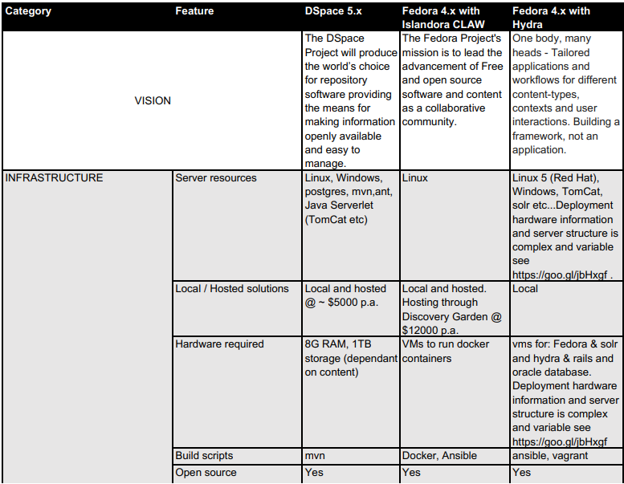
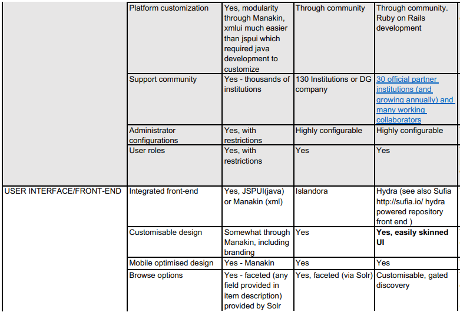
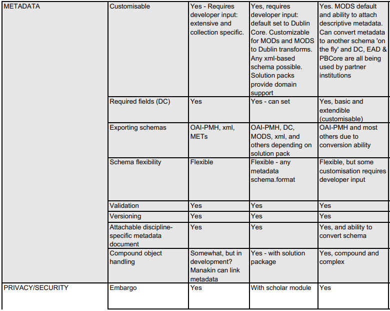
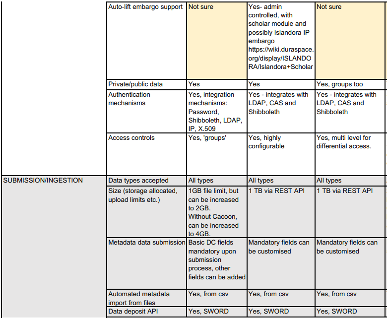
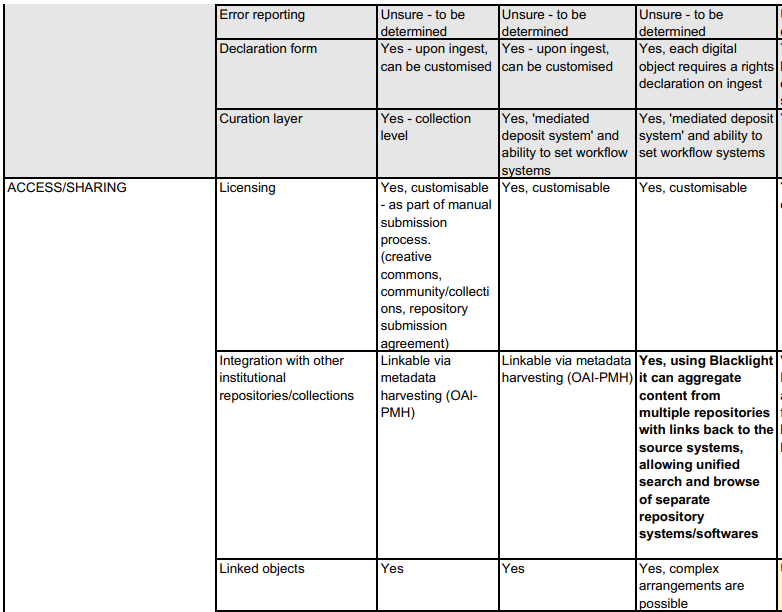
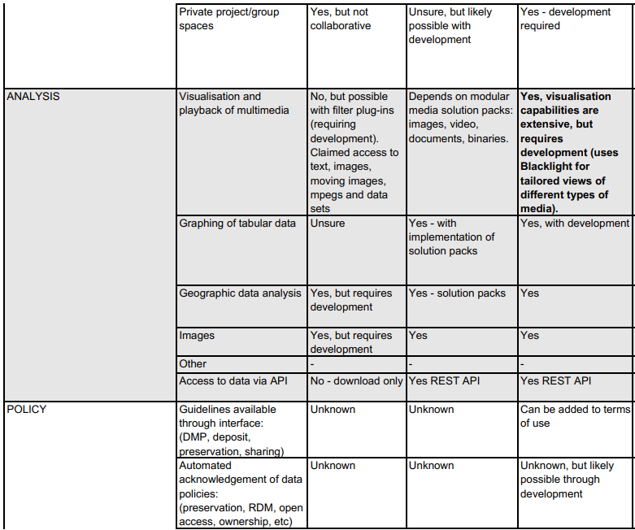

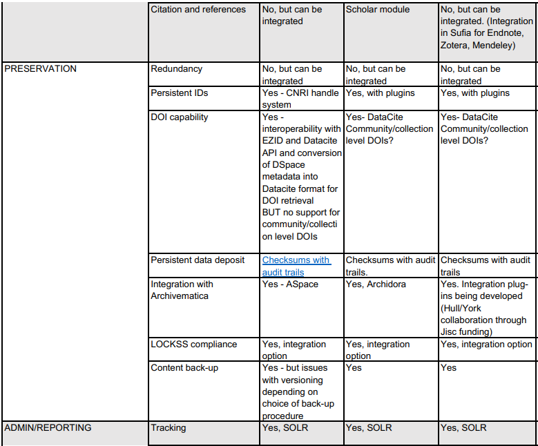
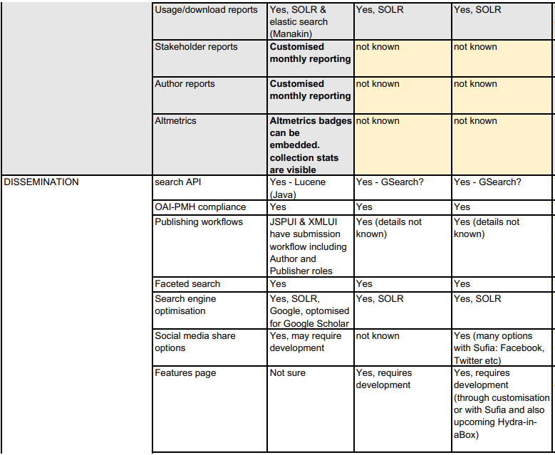
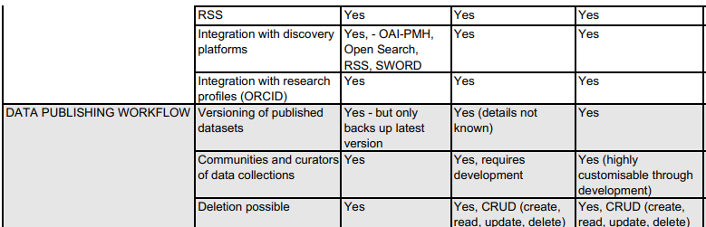

#### 2.3.2 Resume
:warning: to be done

## 3 Preservation
### 3.1 Data Preservation
#### 3.1.1 Generall Meaning
- act of conserving and maintaining both the safety and integrity of data
#### 3.1.2 Goal
- the accurate rendering of authenticated content over time
    -“When data is lost it is as though it never existed”
#### 3.1.3 Methods
- Digital:
    - Digital Preservation: formal endeavor to ensure that digital information of continuing value remains accessible and usable
        -combination of "policies, strategies and actions that ensure this
- Archives:
    - collection of historical documents and records
- Catalogues, directories and portals:
    - consolidated resources which are kept by individual institutions
- Cyber Infrastructures:
    - consists of archive collections which are made available through the system of hardware, technologies, software, policies, services and tools
- Repositories:
    - Repositories are places where data archives and holdings can be accessed and stored. The goal of repositories is to make sure that all requirements and protocols of archives and holdings are being met, and data is being certified to ensure data integrity and user trust
    - Single-site Repositories
    - Multi-Site Repositories
    - Trusted Digital Repostitory (TDR)
        -must cooperate with the Reference Model for an Open Archival Information System, as well as adhere to a set of rules or attributes that contribute to its trust such as having persistent financial responsibility, organizational buoyancy, administrative responsibility security and safety
##### 3.1.4 Data Pyramid

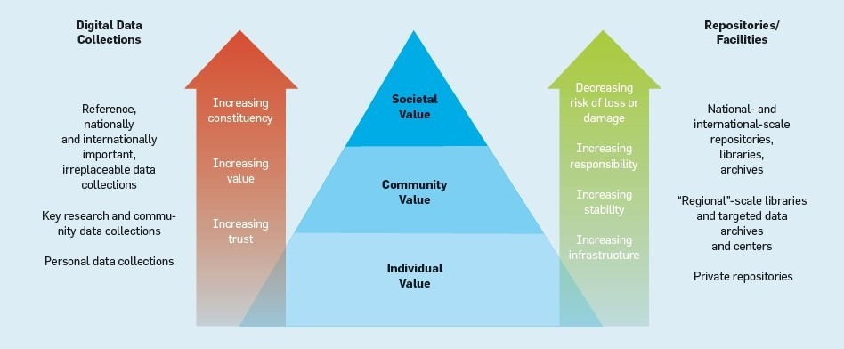

### 3.2 Digital Preservation
#### 3.2.1 Purpose
- Digital Revolution make it easy to create, copy and transmit data all over the world
    - -->increasingly vast amounts of digital research data
- Research data are unique and cannot be replaced if destroyed or lost
- Where resources are "born digital", there is no other format but the digital original
- good practice for institutions and researchers to manage and retain their research data
- A data preservation programme suited to the individual institution must be used to safeguard this huge investment of time and resources
- “Digital Heritage” has cultural, historical, aesthetic, archaeological, scientific, ethnological or anthropological value and is increasing
#### 3.2.2 Problems
- Technological advances even more rapidly, reducing the time before a technology becomes obsolete
- Data is recorded on a transient medium, in a specific file format and needs a transient coding scheme to interpret them
- Machine needs to be interposed between the data ant the human interpreter
- Selecting the right data is difficult because there are many points of view and these are changing from time to time
#### 3.2.3 Foundamentels
##### 3.2.3.1 Appraisal
- Process of identifying records and other materials to be preserved by determining their permanent value. It is a difficult and critical process because the remaining selected records will shape researchers’ understanding of that body of records, or fonds. Archival appraisal may be performed once or at the various stages of acquisition and processing
##### 3.2.3.1 Identification
- Identification through assigned identifiers and accurate descriptive metadata.An identifier is a unique label that is used to reference an object or record, usually manifested as a number or string of numbers and letters. As a crucial element of metadata to be included in a database record or inventory, it is used in tandem with other descriptive metadata to differentiate objects and their various instantiations
##### 3.2.3.1 Integrity
- Assurance that the data is "complete and unaltered in all essential respects". Is the Cornerstone of Preservation. Unintentional changes to data are to be avoided, and responsible strategies put in place to detect unintentional changes and react as appropriately determined
##### 3.2.3.1 Fixity
- Process of validating that a file has not changed or been altered from a previous state. While checksums are the primary mechanism for monitoring fixity at the individual file level, an important additional consideration for monitoring fixity is file attendance
##### 3.2.3.1 Characterization
- Characterization of digital materials is the identification and description of what a file is and of its defining technical characteristics often captured by technical metadata, which records its technical attributes like creation or production environment
##### 3.2.3.1 Sustainability
- Unlike traditional, temporary strategies, and more permanent solutions, digital sustainability implies a more active and continuous process. Digital sustainability concentrates less on the solution and technology and more on building an infrastructure and approach that is flexible with an emphasis on interoperability, continued maintenance and continuous development
##### 3.2.3.1 Renderability
- continued ability to use and access a digital object while maintaining its inherent significant properties
##### 3.2.3.1 Physical media obsolescence
- Physical media obsolescence can occur when access to digital content requires external dependencies that are no longer manufactured, maintained, or supported. External dependencies can refer to hardware, software, or physical carriers. 
##### 3.2.3.1 Format obsolescence
- File format obsolescence can occur when adoption of new encoding formats supersedes use of existing formats, or when associated presentation tools are no longer readily available.Factors that should enter consideration when selecting sustainable file formats include disclosure, adoption, transparency, self-documentation, external dependencies, impact of patents, and technical protection mechanisms.
##### 3.2.3.1 Significant properties
- Significant properties refer to the "essential attributes of a digital object which affect its appearance, behavior, quality and usability" and which "must be preserved over time for the digital object to remain accessible and meaningful."
##### 3.2.3.1 Authenticity
- Whether analog or digital, archives strive to maintain records as trustworthy representations of what was originally received. Authenticity has been defined as “. . . the trustworthiness of a record as a record; i.e., the quality of a record that is what it purports to be and that is free from tampering or corruption”
##### 3.2.3.1 Access
- Digital preservation efforts are largely to enable decision-making in the future. Should an archive or library choose a particular strategy to enact, the content and associated metadata must persist to allow for actions to be taken or not taken at the discretion of the controlling party
##### 3.2.3.1 Preservation metadata
- There has to be information that documents the preservation process throughout the whole lifecycle of the data
#### 3.2.4 Strategies
##### 3.2.4.1 Online Computer Library Center 4 Point Strategie
- 1.Assessing the risks for loss of content posed by technology variables such as commonly used proprietary file formats and software applications
- 2. Evaluating the digital content objects to determine what type and degree of format conversion or other preservation actions should be applied
- 3. Determining the appropriate metadata needed for each object type and how it is associated with the objects
- 4. Providing access to the content
##### 3.2.4.2 Refreshing
- Refreshing is the transfer of data between two types of the same storage medium so there are no bitrot changes or alteration of data. This process has to be carried out whatever other preservation strategies are adopted and has a low risk of losing data if executed and documented properly 
##### 3.2.4.3 Migration
- Migration is the transferring of data to newer system environments; it involves change in the configuration of the underlying data without changing their intellectual content. It is time-critical and needs to be carried out as soon as new formats are introduced and before the current format gets obsolete
##### 3.2.4.3 Replication
- Creating duplicate copies of data on one or more systems is called replication. Data that exists as a single copy in only one location is highly vulnerable to software or hardware failure, intentional or accidental alteration, and environmental catastrophes like fire, flooding, etc
##### 3.2.4.4 Emulation
- Emulation is the replicating of functionality of an obsolete system. Emulation does not focus on the digital object, but on the hard- and software environment in which the object is rendered. It aims at (re)creating the environment in which the digital object was originally created. Used for more complex data where migration will lead to loss of data
##### 3.2.4.5 Encapsulat
- This method maintains that preserved objects should be self-describing, virtually "linking content with all of the information required for it to be deciphered and understood"
##### 3.2.4.6 Persistent Archives concept
- This method requires the development of comprehensive and extensive infrastructure that enables "the preservation of the organisation of collection as well as the objects that make up that collection, maintained in a platform independent form"
##### 3.2.4.7 Metadata attachment
- Metadata attached to digital files may be affected by file format obsolescence. Preservation strategies are only successful if the data is fully documented throughout their lifecycle
#### 3.2.5 Software Preservation Network (SPN)
- leading organization established to facilitate and support software preservation efforts
- preserves software through community engagement, infrastructure support, and knowledge generation
- Values:
    - Community
        - “Software spans sectors, industries and disciplinary domains. Through our shared community of practice we develop a body of shared tools, responses and strategies for preservation, reuse and sharing of software”
    - Sustainability
        - “Sustainable preservation is not achieved by a single decision or action. It requires a series of decisions made by multiple actors and stakeholders over the lifecycle of digital resources.”
    - Access
        - “Access must accommodate current and future users. The Access Breakdown is the breakdown of social structures that support information access; this breakdown necessitates system level change that acknowledges software as infrastructure.”
    - Transparency
        - “True transparency is culturally ingrained in the DNA of the organization. It encourages constructive questioning and honest probing focused on mission and guided by core beliefs.”
    - Advocacy
        - People or groups advocate to influence decisions within political, economic and social systems. “[advocacy] is integral to all aspects of archival work.”
#### 3.2.6 The OAIS Reference Model
- The functional model gives a detailed break-down of digital preservation and dissemination workflows – in short, it explains how an (idealized) archive works. It therefore is a good starting point for anyone who seeks to obtain a systematic overview of these workflows or wants to analyze and understand workflows in an existing archive.

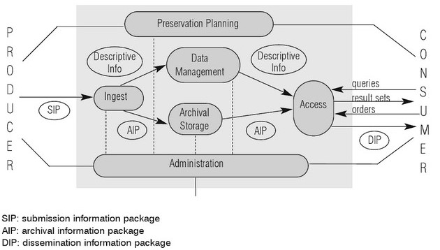

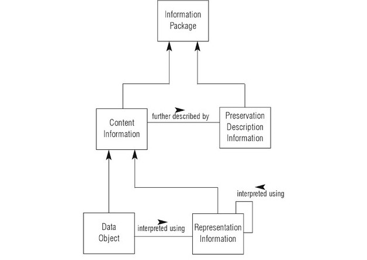

## Source Disclosures
- https://www.gesis.org/en/services/archiving-and-registering/data-archiving/long-term-preservation/
- http://www.softwarepreservationnetwork.org/
- https://earthdata.nasa.gov/user-resources/standards-and-references/preservation-content-spec
- https://www.sciencedirect.com/science/article/pii/S0920379612003225
- https://en.wikipedia.org/wiki/Data_preservation
- https://en.wikipedia.org/wiki/Digital_preservation
- http://www.dcc.ac.uk/digital-curation/why-preserve-digital-data
- http://www.unesco.org/new/en/communication-and-information/access-to-knowledge/preservation-of-documentary-heritage/digital-heritage/concept-of-digital-heritage/
https://wikidiff.com/archive/repository
- http://www.dpworkshop.org/dpm-eng/terminology/repository.html
- User Guide for digital preservation OASI
- Francine Berman, Got data?: a guide to data preservation in the information age (2008)
- Marilyn Deegan & Simon Tanner, Digital Preservation 
