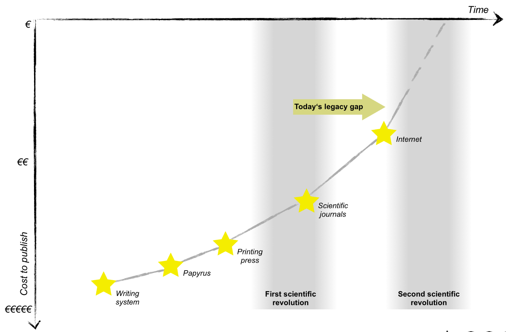
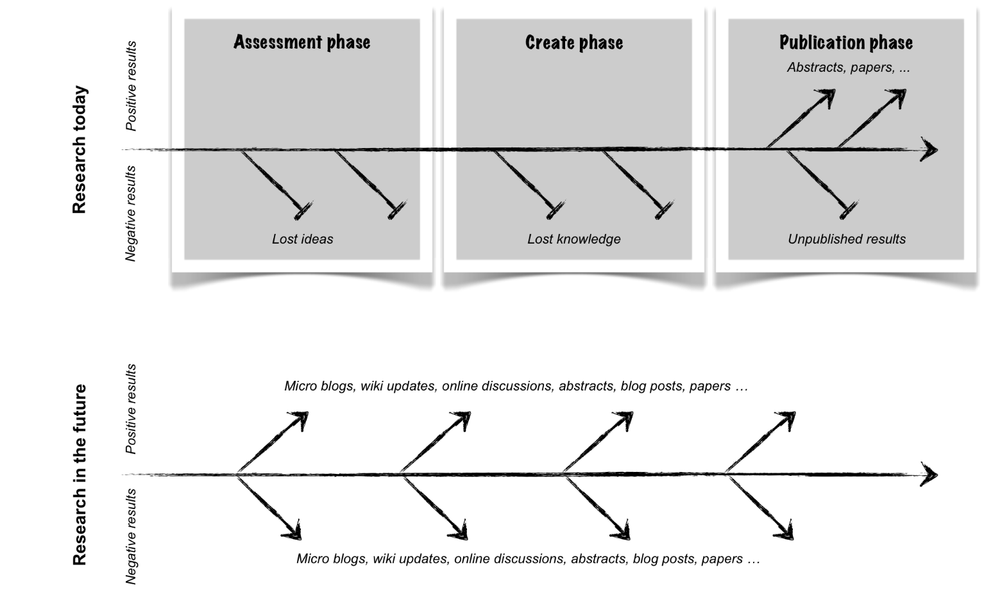
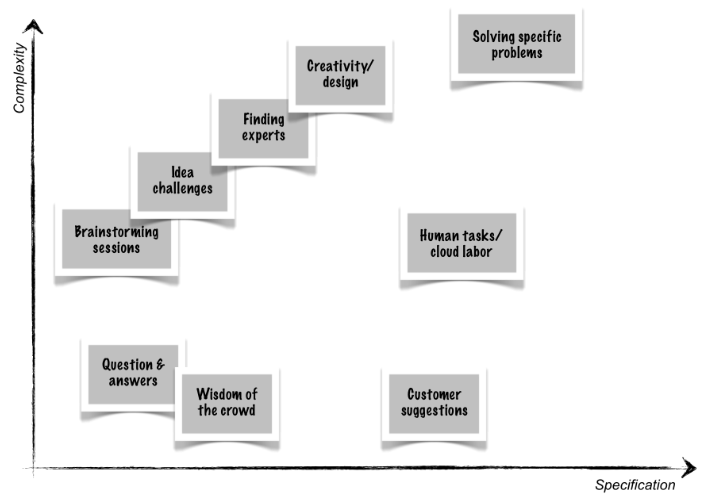

# Scholarly Publishing - History and Future

Westfälische Wilhelms-Universität Münster
Gesoftware 2

Ilka Pleiser, [@ipleis](https://github.com/ipleis)

___

### 3.3 Million B.C.

  - Knowledge was given from one generation to the following
    - Orally
    - By showing certain techniques (hunting, manufacturing clothes or tools, …)
- Dissemination was not yet structured neither recorded
- Change: Invention of writing systems
    - Part of origin of civilization
- Creation of knowledge speeded up

___
### 1600 B.C.

-	Profession “scientist” appeared in the ancient Greece firstly
    - Plato, Aristotle, Pythagoras, Socrates, Archimedes (…)
    - Noting observations and teaching pupils
    - Professions called philosophers, physicists, mathematicians (…)
- Almost same development in China at the same time
    - Laozi, Sun Tzu and Confucius
___

### The Middle Age

- Time of censorship through church
- Important scientific questions and assumptions were forbitten to publish or even discuss
- Development of creation and distribution of knowledge slowed enormously

___
### The 17th century and the "First Scientific Revolution"

- Enabling of mass production through invention of the printing press (early 17th century)
- Emancipation of researchers from church
- Epoch-making discoveries in almost every existing discipline
    - Made by only a few polymaths
    - Goethe, Leibniz, Galilei, Da Vinci (…)
    - Classic disciplines (biology, mathematics, anatomy, …) developed faster than ever before
- Number of scientists increased
- A lot more disciplines have been formed
- “First scientific revolution”
    - Professionalization of knowledge creation
- Spadework for a lot of disciplines arose
- New scientific disciplines were invented
- Before the adoption of a publishing system:
    - researchers studied in secret
    - rare exchange with other researchers
    - rare publishing of results
- Breakthrough was the development of a journal publication system
- First journal focusing scientific topics: “Philosphical Transaction”
- Scientific results open for other researchers
- Almost every academic work was/is published printed on paper

___
### "Pre-Internet" and the "Second Scientific Revolution"

- Printing was very expensive
    - BUT: offered the only opportunity of publishing and getting knowledge (and earn money)
    - Lectures had to be accomplished and correct
        - Publishers were in charge to control papers
- Big change with the invention of the Internet

___
### Present

- “Internet as academic platform" is integrated in our scientific culture
- “Internet as academic platform" in everyday life:
    - Learning platforms in schools and universities
        - Learnweb
    - Platforms for showing results or discussing questions (even as portfolio)
        - E.g. Github, Stack-Overflow
    - Open editable encyclopedias
        - E.g. Wikipedia
- Almost free of charge
- Enables
    - fast and free exchange and communication
    - publications (mostly free)
    - discovering findings (mostly free)
    - collaboration between researchers from all over the world
- But most publications (especially theses) are still printed on paper
    - Additionally, published on the web
- So called Preprints are Versions of work not controlled yet
  - mostly digital

#### Crowdsourcing
- "Outsourcing of tasks to a crowd"
    - Group of people sharing interests or research fields
- Clients are
    - NPO's, companies, scientists, artists, governments
- Example: Wikipedia
- Difference between "crowd voting" and "crowd creation"
    - from answering simple questions to solve difficult problems

- Risks:
    - No guarantee of finding a solution (even with a lot of persons joining)
    - A lot of ideas (from the crowd) have to be evaluated
        - takes time
    - Often disputes about the question of intellectual property

#### Forms of Dynamic Publications
Books and Articles | Blogs | Wikis | Stack Exchange
------------ | ------------- | ------------- | -------------
most academic papers are (also) published printed | only the author is responsible for his/hers work |starter wikipedia.com | work through comment threads
researches and results are closed, complete and correct | usually only written by one person |can be edited from a huge mass of people at the same time (without any qualification) | c.t. are question, comments, opinions
production process mostly only open to the authors and lectors  | academic blogs usually contain reviews, summaries, researches ongoing | grew a lot since the invention | questions and answers get evaluated by other users
... | also guesses and unproven results are published  | open, free of charge | examples: Stack-Overflow
#### Dynamic Publication Formats
Dynamic | Openness | Authorship
------------ | ------------- | -------------
no static version existing | all discussions can be open | collaborative authoring
changes are done in different ways (words, paragraphs) | openness for securing of quality | easy to see who is editing what
changes can also be adds and deletions  | limited visibility of a work in process possible  | easy to see which idea is from whom
-| publishing only when all co-authors agree with the current form  | personal reputation of scientists

#### Newest Innovations
- cOALition S
    - Funded in September 2018 by 11 national research funding organizations (European Commission and the ERC)
    - Contribute "full and immediate Open Access to research publications"
    - Until 2020
    -  “By 2020 scientific publications that result from research funded by public grants provided by participating national and European research councils and funding bodies, must be published in compliant Open Access Journals or on compliant Open Access Platforms.”
    -  All scientific publications "provided by national and European research councils and funding bodies, must be published in compliant Open Access Journals or on compliant Open Access Platforms"

___
### Future
- Possible backchannel of research and development departments
    - Because of open innovation
- Who should/will be the boosters in scientific questions?
- Scientists, publishers, other stakeholders?
- Will scientific knowledge be the biggest benefactor?
- Are we making/does the Internet make science more "liberal, open and fair" or is it making the converse of that?

### Conclusion

>"To conclude, much will depend upon whether researchers become the leading force within this transition (...).
>Researchers should be deeply involved in this process and they should be aware of the potential consequences."
>-Towards Another Scientific Revolution, Sönke Bartling & Sascha Friesike-

___
#### Sources:
1.	Literature:
- Past:
  - Scholarly Publishing: A Brief History, Ben Mudrak, PhD
- Present:
  - Open Innovation and Crowdsourcing in the Sciences, Thomas Schildhauer & Hilger Voss (http://book.openingscience.org.s3-website-eu-west-1.amazonaws.com/vision/open_innovation_and_crowdsourcing_in_science.html)
  - Dynamic Publication Formats and Collaborative Authoring, Lambert Heller, Ronald The & Sönke Bartling (http://book.openingscience.org.s3-website-eu-west-1.amazonaws.com/vision/dynamic_publication_formats.html)
- Future:
  - Towards Another Scientific Revolution, Sönke Bartling & Sascha Friesike
  - Academia Goes Facebook? - The Potential of Social Network Sites in the Scholarly Realm, Michael Nentwich & René König (http://book.openingscience.org.s3-website-eu-west-1.amazonaws.com/tools/academia_goes_facebook.html)

2.	Internet:
- Present
  - Academic publishing, Wikipedia.com, https://en.wikipedia.org/wiki/Academic_publishing
  - Scholarly peer review, Wikipedia.com, https://en.wikipedia.org/wiki/Scholarly_peer_review
  - cOALition S, https://www.scienceeurope.org/coalition-s/
  - https://www.aje.com/en/arc/scholarly-publishing-brief-history/
  - https://de.wikipedia.org/wiki/Preprint

