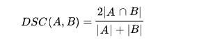

# Spatial similarity calculation

_Authors: Benjamin Dietz [(@bennidietz)](https://github.com/bennidietz) , Jannis Fröhlking_ [(@JaFro96)](https://github.com/JaFro96)

- [1 Why spatial similarity calculations](#1-why-spatial-similarity-calculations3)
- [2 Our first idea of spatial similarity calculation](#2-our-first-idea-of-spatial-similarity-calculation)
- [3 Categories to measure spatial similarity](#3-categories-to-measure-spatial-similarity45)
  * [3.1 Topological](#31-topological)
  * [3.2 Directional](#32-directional)
  * [3.3 Metric distance](#33-metric-distance)  
  * [3.4 Attribute (not in our focus)](#34-attribute-not-in-our-focus)
- [4 Automated map generalization](#4-automated-map-generalization3)
- [5 Calculation of spatial similarity with respect to properties](#5-calculation-of-spatial-similarity-with-respect-to-properties3)
- [6 Spatial similarity of raster data](#6-spatial-similarity-of-raster-data67)
  * [6.1 Jaccard Index](#61-jaccard-index)
  * [6.2 Sørensen–Dice coefficient](#62-sørensendice-coefficient)
  * [6.3 Hamming distance](#63-hamming-distance)
- [7 Summary](#7-summary)
- [8 Sources and further readings](#8-sources-and-further-readings)

# 1 Why spatial similarity calculations?[[3](#8-sources-and-further-readings)]

  - discover the most relevant spatial datasets in the ever-growing global spatial data infrastructures (SDIs)
  - finding similar objects to a given one becomes more popular and common in geographic informations systems
  - crucial factor in intelligent and automatic spatial data processing such as automated map generalization

    ### Problem:

  - it is evident that the similarity degree between the original map (M0) and the generalized map (M1) decreases when the scale change increases
  - but no achievements have been made on quantitatively describing this relation (similarity degree):
	 - map generalization system/software does not know to what extent an original map (M0) should be generalized and when the algorithm should terminate

# 2 Our first idea of spatial similarity calculation

  - transform vector to raster
  - similarity = equal pixels/overall pixels of addition of both spatial objects:

## Similarity:
  - two pixels remained (green) and four pixels are part of just one of the two objects (red)
  - result: Sim=2/6=⅓

### Note:
  - these boolean similarity operations often cannot adequately account for the uncertainty and complexity inherent in spatial information

# 3 Categories to measure spatial similarity[[4,5](#8-sources-and-further-readings)]

The following categories are based on this initial example of two squares:

  

## 3.1 Topological:

  - provide a notion of the general structure and the interactions of spatial objects
  - avoids geometry
  - using topological primitives: boundary, interior and exterior
  - allows defining the relationships between 0D (point), 1D (linestring), 2D (surface) and 3D (body) spatial objects in 0D, 1D, 2D, and 3D

  

### Example: The 9-intersection model

describes binary topological relations in terms of the intersections of the interiors, boundaries, and exteriors of the two spatial objects

  - six object parts (each of the lines interior, boundary and exterior with each of the regions interior, boundary and exterior)

  

  - topological invariants:
     - distinction of content (emptiness or non-emptiness of intersection):
     3x3 bitmap with each of these nine intersections

     

     512 (2^9) possible relations, but most of these relations are impossible for objects in the 2-D Cartesian plane
  - in fact: 19 combinations are possible:
  - This diagram illustrates these combinations
  - situations are connected in the diagram if they differ for exactly one of the nine &quot;intersections&quot;
  - the __more edges__ are needed to get from one situation to another, the __less similar__ are the two situations

 

**Influence of geometry:**

40 Subjects were asked to rate their agreement on the sentence &quot;road crossing the park&quot; for each topologically-identical stimuli:

  - very different ratings although the topology is identical
  	➢  geometry influences the similarity

  

### Note:
- _asymmetric relations_: relations apply between line objects and region objects but not between a region and a line

  ➢  region can be left of directed line that is coincident with part of its boundary, but without an external reference frame a line cannot be left-of any region

## 3.2 Directional:

  - qualitative spatial relation that describe how an object or a region is placed relative to other objects or regions
  - Examples: south, northeast, front, and back-right

## 3.3 Metric distance:

  - direct measure between two points in some spatial space

### Example: Geohashes - &quot;an encoding format for spatial information&quot;

  - idea: referencing locations in emails, forums and websites gets more convenient
    → very simple
  - encode (latlon) → string
    e.g. 51.969173, 7.59578 →u1jrsuen6
  - the longer a shared prefix is, the closer the two places are
  - limitations when used for deciding proximity
    - Edge cases
    - Non-linearity (different distance at the poles and the equator for one geohash area)
  - Geohash representation of a set of points:
    

## 3.4 Attribute (not in our focus):  

Attribute can be any non-spatial property of the object. An example is the property &quot;arability&quot;.
This attribute describes whether the land can be used for agriculture or construction. E.g. a white object (B)
may stand for an arable object and a black object (A) may stand for a non-arable object.

# 4 Automated map generalization[[3](#8-sources-and-further-readings)]

 **=> introduces spatial similarity calculations of the same objects at a different scale**

  -  can create a multi-scale map by only building one map database using the maps at the largest scale
  - map generalization can have different generalization criteria which are usually one or more thresholds in the algorithm
  - the determination of the thresholds takes into account: the original map scale, the resulting map scales and the purpose of the resulting map
  - it is (hence) necessary to find methods for automatically obtaining such threshold values
  - if approaches to calculating the similarity degree between two maps are known, it is possible to find out an approach for calculating the threshold value (with given scale of the resulting map)
  - based on threshold values, the algorithms can become parameter-free and therefore fully automatic => calculation of similarity degrees between two maps is of great importance in automated map generalization
  - map generalization processes usually abides “divide-and-conquer” to make it simple and efficient

  **Which map is the best and should be the resulting map?:**

  - possible approach: calculate the similarity degree between the original map and each generalized map and select the one with the greatest similarity degree as the resulting map
  - reason for that approach: the more similar two maps are, the more common information the two maps contain

# 5 Calculation of spatial similarity with respect to properties[[3](#8-sources-and-further-readings)]

  - spatial similarity measurement is different from document/ texts similarity assessment (matching keywords) because:
  - spatial similarity relations involve various elements, such as spatial relationship, spatial distribution, geometric attributes, thematic attributes and semantic relationship
  - different application may have different requirements and priorities which makes calculation of spatial similarity relations complicated
  - the definition of similarity is closely application-oriented, based on corresponding assumptions and functions lay on experience
  - the spectrum from each spatial similarity degree goes from 0 (not similar at all) to 1 (equal)
  - “difference” as contra expression for “similarity”

The upcoming definitions of spatial similarity relations/ degrees are explained with the following example of the two object A1 and A2:

**Example 1** : Object A1 and A2 are two objects in the geographic space and their property sets are P1 and P2, respectively. A property can be anything that describes the object, here the chosen properties are the area, the shape and the arability of each object, so P = {area, shape, arability}. Each object has a value for each property. In the area property the object can be classified into &quot;large&quot; (3), &quot;big&quot; (2) and &quot;small&quot; (1). The shape of the object is described by the number of edges of the polygon. The arability can be either &quot;yes&quot; (2) or &quot;no&quot; (1). So the property set in this example are: P1 = {2, 6, 1} and P2 = {2, 9, 1}. Since some properties are more important for the similarity of the object than others, the properties get weight which are in this case w = {0.3, 0.6, 0.1} meaning e.g. 30% of the similarity depends on the area of the objects.

**Note:**

  - selection of properties used in spatial similarity relations is a **subjective** process
  - the weight values of the properties should be obtained by psychological experiments with sufficient number of evaluating people as well as (different) appropriate objects
  - properties spatial properties (where we focus on) and attribute properties
  - the validity of the definition depends on users&#39; judgments

  `Def. 1 : Spatial similarity relation of/ degree between object A1 and A2 at property Pi:`

  
each property has own function - the value is ϵ [0,1]

  `Def. 2 : Spatial similarity relation of/ degree between Object A1 and A2:`

  
  the value is ϵ [0,1]

### Example calculation for Def. 1 and Def. 2 with Example 1:

The spatial similarity relation of object A1 and object A2 at property P1 is

(object A1 and A2 are at property P1 equal).

At property P2 the similarity relation between two objects is not trivial:

_∨(a,b) meaning the smaller number of a and b_

Since the object are equal at property P3, the spatial similarity relation of object A1 and object A2 is

(meaning the spatial similarity relation of the two objects is 88 %)

  - in the geography the spatial similarity relation is **scale dependent** meaning the more an object is simplified (generalized), the less similar it is if compared to the original object: Sim(A, A1) > Sim(A, A2) > … > Sim(A, An-1) > Sim(A, An)

### Example where the property &quot;shape&quot; does not fit perfectly for calculation similarity and our own idea how to solve this problem:

We use this example for showing that the property &quot;shape&quot; is not for all objects well defined:

The property &quot;shape&quot; is defined as the number of edges of the object. Here, Object 1 has 5 edges and object 2 has 21 edges. Meaning with P = {area, shape, arability}:  P1 = {2,5,1} and P2 = {2,21,1}.

Calculating the similarity of the two objects with the formulas from Def. 1 and Def. 2 as above, we get a similarity of 62.8 % between the two objects although most people would probably say the similarity of those two is about 90 % or higher.

__Our own idea for solving this problem:__

__Repetition__: _Douglas-Peucker-Algorithmus_

  - _define an epsilon (how far deviations from a line should be tolerated)_
  - _remove all edges that distance to the currently considered line are smaller than the epsilon_
  - _further reading:_ [_Wikipedia Article_](https://de.wikipedia.org/wiki/Douglas-Peucker-Algorithmus)

  

**Idea:**

1. If the Douglas-Peucker algorithm remove enough edges of the object for a sufficiently small epsilon [dependent on the area of the object(s)], operate it on the object(s)!
2. Count the number of edges of the new object
3. Now the number of edges get a greater meaning for the similarity of objects (describe the shape of an object more suitable)

# 6 Spatial similarity of raster data[[6,7](#8-sources-and-further-readings)]

Assumptions:
- both maps are spatially on the same place
- we want to compute the similarity of a specific discrete variable

## 6.1 [Jaccard index](https://en.wikipedia.org/wiki/Jaccard_index)
- size of the intersection divided by the size of the union (basically our first idea)

      
## 6.2 [Sørensen–Dice coefficient](https://en.wikipedia.org/wiki/S%C3%B8rensen%E2%80%93Dice_coefficient)
- twice the number of elements in the intersection divided by the sum of the number of elements in each set.

### Relation between these indices
- J: Jaccard Index, S: Sørensen-Dice coefficient
__J=S/(2-S)__

## 6.3 [Hamming Distance](https://en.wikipedia.org/wiki/Hamming_distance)
[Definition of Technopedia](https://www.techopedia.com/definition/19723/hamming-distance):
> A Hamming distance in information technology represents the number of points at which two corresponding pieces of data can be different. 
> It is often used in various kinds of error correction or evaluation of contrasting strings or pieces of data.

Example: 
The Hamming distance of 10**1**1**1**01 and 10**0**1**0**01 is 2.

# 7 Summary:

- role of spatial similarity increases with the rise of intelligent and automatic spatial data processing
- spatial similarity is a mixture of various categories
- no &quot;one-fits-all&quot;-solution -> spatial similarity is subjective
- spatial similarity is based on human cognition
-> very complex to find a reliable model

# 8 Sources and further readings:

  - **[[1] Spatial relations between lines and regions](https://pdfs.semanticscholar.org/62e2/96f9e81f175751907f3e2c919dffdcaae56b.pdf)** (1994: Mark, Egenhofer)
  - **[[2] Relation between spatial similarity and map scale change in mulit-scale maps](https://ac.els-cdn.com/S1674984715000191/1-s2.0-S1674984715000191-main.pdf?tid=ace53621-8259-44eb-bd32-e80ecb415137&acdnat=1538735023_3c975278e6a2171fa660b98d014922d8)** (2015: Weifang)
  - **[[3] Spatial Similarity Relations in automated map generalization](https://uwspace.uwaterloo.ca/handle/10012/8317)** (2014: Yan)
  - **[[4] Directional relations](https://link.springer.com/referenceworkentry/10.1007/978-3-319-23519-6_1539-1)** (2015: Skiadopoulos)
  - **[[5] Distance Metrics](https://link.springer.com/referenceworkentry/10.1007/978-3-319-23519-6_307-2)** (2016: Kang)
  - **[[6] How to statistically compare two maps?](https://www.researchgate.net/post/How_to_statistically_compare_two_maps)**
  - **[[7] Map Comparison Kit](http://mck.riks.nl/)**
  - [8] Similarity Measurements for Executable Research Compendia (2018: Lohoff)
