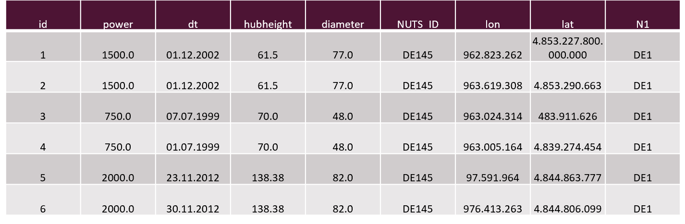

# Time Series Data Formats &amp; Libraries

Katharina Hovestadt [@KathHv](https://github.com/KathHv) und Carolin Wortmann [@carojw](https://github.com/carojw)

## [Time Series](http://itfeature.com/time-series-analysis-and-forecasting/time-series-analysis-forecasting)

- Datenpunkte, die in einer bestimmten zeitlichen Ordnung vorliegen
  - B. Einwohnerentwicklung, Temperaturmessungen im Laufe eines Zeitabschnittes
- Unterscheidung zwischen diskret und kontinuierlich
  - kontinuierlich: y(t)
  - diskret: yt mit t aus {1,…,n} als zeitdiskreter  stochastischer Prozess; die Zeitintervalle zwischen den einzelnen Punkten das Zeitreihe sind konstant
- [Zeitreihenanalyse](https://de.statista.com/statistik/lexikon/definition/144/zeitreihenanalyse/) **:**
  - Zweck:
    - Untersuchung und Verständnis der einer Datenreihe zugrunde liegenden Kräfte, Strukturen, Abhängigkeiten und Muster
      - Saisonale Muster, Entwicklungen (Trends)
    - Anpassung von Modellen an die Daten
    - Nutzung zu Vorhersage, Monitoring und Reaktion
  - Art der Analyse stark abhängig von zu untersuchenden Daten und Zweck der Analyse
  - Sehr unterschiedliche Anwendungsgebiete: Statistik, Mustererkennung, Wirtschaft, Meteorologie, Astronomie, Erdbebenvorhersage, …..
- siehe z.B. auch Veranstaltung „Einführung in die Modellierung dynamischer räumlicher Prozesse&quot;

## [Tabellarische Darstellung von Datums- und/oder Zeitformaten mittels CSV](https://www.w3.org/TR/2015/REC-tabular-data-model-20151217/#formats-for-dates-and-times)

Tabellarische Daten werden häufig im CSV-Format gespeichert.

[CSV-Format](https://www.w3.org/TR/2015/REC-tabular-data-model-20151217/#standards):

- UTF-8
- Dateiendung .csv
- Die erste Zeile beschreibt den Tabellenkopf (Überschriften der einzelnen Spalten) -\&gt; als ID der Spalte genutzt
- Datapackage.json Datei, um CSV-Datei zu beschreiben
- Jedes Feld wird mit einem Komma (Trennzeichen) von den Nachbarzellen getrennt
- Beispiel:

```
Datum, Ort, Temperatur in Grad Celsius,
2018-09-25T12:00, Rheine, 2.5,
2018-09-25T12:00, Emden, ,
2018-09-27T12:00, Rheine, 3.5,
2018-09-27T12:00, Emden, 5.0
```

->

| Datum | Ort | Temperatur in Grad Celsius |
| ---| --- | --- |
| 2018-09-25T12:00 | Rheine | 2.5 |
| 2018-09-25T12:00 | Emden |  |
| 2018-09-27T12:00 | Rheine | 3.5 |
| 2018-09-27T12:00 | Emden | 5.0 |


Standard: Datum und Zeit werden im Format xml-schema11-2 dargestellt, um dann tabellarisch gespeichert zu werden (z.B. im CSV-Format).

[Xml-schema11-2:](https://www.w3.org/TR/2015/REC-tabular-data-model-20151217/#bib-xmlschema11-2) verschiedene Datentypen wie z.B.

- [duration](https://www.w3.org/TR/xmlschema11-2/#duration)
  - Zeitdauer
  - Konzept der Erfassung und Darstellung wurde von [ISO8601](https://www.w3.org/TR/xmlschema11-2/#ISO8601) übernommen
  - Addition und Subtraktion werden unterstützt
  - Beispiel: P1Y2M3DT4H5M6S -\&gt; 1 Jahr, 2 Monate, 3 Tage, 4 Stunden, 5 Minuten und 6 Sekunden
- [dateTime](https://www.w3.org/TR/xmlschema11-2/#dateTime)
  - Zeitpunkt, mit Zeitzone
  - Werte, die die Selbe Zeit zeigen aber unterschiedliche Zeitzonen haben sind zwar gleich aber nicht identisch
  - Kein Wert, außer der Zeitzone darf fehlen
  - Beispiel: 2018-10-25T12:02:05+01:00 -> 25. Oktober 2018, 12:02Uhr und 5 Sekunden in der Zeitzone +1 -> MEZ (Winterzeit in Deutschland)
  - Angabe der Zeitzone ist freiwillig
- [time](https://www.w3.org/TR/xmlschema11-2/#time)
  - HH:MM:SS
  - Repräsentiert den jeweils selben Zeitpunkt an jedem Kalendertag
- [date](https://www.w3.org/TR/xmlschema11-2/#date)
- Für den Gregorianischen Kalender
  - [gYearMonth](https://www.w3.org/TR/xmlschema11-2/#gYearMonth)
    - YYYY-MMZTimezone
  - [gYear](https://www.w3.org/TR/xmlschema11-2/#gYear):
    - YYYYZTimezone
    - 2017+5
  - [gMonthDay](https://www.w3.org/TR/xmlschema11-2/#gMonthDay)
    - --MM-DDZTimezone
  - [gDay](https://www.w3.org/TR/xmlschema11-2/#gDay)
    - ---DDZTimezone
    - Vorsicht bei der Verwendung mit anderen Kalendern, da jeder Monat nur mit 28 Tagen berechnet wird
  - [gMonth](https://www.w3.org/TR/xmlschema11-2/#gMonth)
    - --MMZTimezone
    - Kann genutzt werden um zu verdeutlichen in welchem Monat ein Ereignis stattfindet
- [yearMonthDuration](https://www.w3.org/TR/xmlschema11-2/#yearMonthDuration)
  - (-)PYYYYMM
  - P2018-10-25
- [dayTimeDuration](https://www.w3.org/TR/xmlschema11-2/#dayTimeDuration)
  - (-)PHH:MM:SSZTimezone
  - P12:02:05
- [dateTimeStamp](https://www.w3.org/TR/xmlschema11-2/#dateTimeStamp)
  - YYYY-MM-DDTHH:MM:SSZTimezone
  - 2018-10-25T12:02:05+01:00
  - Unterschied zur datetime ist die verpflichtende Angabe der Zeitzone

Zur Tabellarischen Darstellung im CSV-Format werden die folgenden Datums- und Zeitformate unterstützt:

- Datumsformat
  - `yyyy-MM-dd` z.B. `2015-03-22`
  - `yyyyMMdd` z.B. `20150322`
  - `dd-MM-yyyy` z.B. `22-03-2015`
  - `d-M-yyyy` z.B. `22-3-2015`
  - `MM-dd-yyyy` z.B. `03-22-2015`
  - `M-d-yyyy` z.B. `3-22-2015`
  - `dd/MM/yyyy` z.B. `22/03/2015`
  - `d/M/yyyy` z.B. `22/3/2015`
  - `MM/dd/yyyy` z.B. `03/22/2015`
  - `M/d/yyyy` z.B. `3/22/2015`
  - `dd.MM.yyyy` z.B. `22.03.2015`
  - `d.M.yyyy` z.B. `22.3.2015`
  - `MM.dd.yyyy` z.B. `03.22.2015`
  - `M.d.yyyy` z.B. `3.22.2015`

- Zeitformat
  - `HH:mm:ss.S` (die Anzahlt der "S" entscheidet über die Anzahl der Nachkommastellen für die Sekundenanzahl z.B. `HH:mm:ss.SSS` für `15:02:37.143`)
  - `HH:mm:ss` z.B. `15:02:37`
  - `HHmmss` z.B. `150237`
  - `HH:mm` z.B. `15:02`
  - `HHmm` z.B. `1502`
- Datums- und Zeitformat
  - `yyyy-MM-ddTHH:mm:ss.S` (die Anzahl der "S" entscheidet über die Anzahl der Nachkommastellen für die Sekundenanzahl z.B. `yyyy-MM-ddTHH:mm:ss.SSS` für `2015-03-15T15:02:37.143`)
  - `yyyy-MM-ddTHH:mm:ss` z.B. `2015-03-15T15:02:37`
  - `yyyy-MM-ddTHH:mm` z.B. `2015-03-15T15:02`
  - jedes oben angegebene Datumsformat kann, gefolgt von einem Leerzeichen mit einem obengenannten Zeitformat kombiniert werden: z.B. `M/d/yyyy HH:mm` für `3/22/2015 15:02` oder `dd.MM.yyyy HH:mm:ss` für `22.03.2015 15:02:37`
- Format mit Zeitzone
  - `X` z.B. `-08`, `+0530`, oder `Z` (Minuten sind optional)
  - `XX` z.B. `-0800`, `+0530`, oder `Z`
  - `XXX` z.B. `-08:00`, `+05:30`, oder `Z`
  - `x` z.B. `-08` oder `+0530` (Z ist nicht erlaubt)
  - `xx` z.B. `-0800` oder `+0530` (Z ist nicht erlaubt)
  - `xxx` z.B. `-08:00` oder `+05:30` (Z ist nicht erlaubt)
  - `yyyy-MM-ddTHH:mm:ssXXX` für `2015-03-15T15:02:37Z`
  - `2015-03-15T15:02:37-05:00`
  - `HH:mm x` für `15:02 -05.`

(Beispiele von https://www.w3.org/TR/2015/REC-tabular-data-model-20151217/#formats-for-dates-and-times)

Diese Formate unterstützen keine ausgeschriebenen Monate und zweistelligen Jahreszahlen.

Perioden werden im CSV Format immer nach xmlschema11-2 im ISO8601 Format dargestellt:

- -?PnYnMnDTnHnMnS
- Beispiel:
  - P1Y1D ->; 1 Jahr und 1 Tag
  - PT2H30M -> 2 Stunden 30 Minuten

## Orthogonale mehrdimensionale Arrays zur Darstellung von Zeitformaten (NetCDF CF time series)

 NetCDF steht für Network Common Data Form und ist ein binäres Dateiformat. In seinem Header werden die Metadaten beschrieben. Die Daten selbst sind dann in Arrays angelegt.
 Um die Datenobjekte abgreifen zu können, wird ein Interface benötigt.
 Dieses Interface (NetCDF) kann [hier](https://www.unidata.ucar.edu/downloads/netcdf/index.jsp) heruntergeladen werden.
 NetCDF Dateien sind plattformüvergreifend. Sie werden häufig im atmosphärischen oder ozeanographischen Bereich zum Speichern von Temperatur, Druck, Windgeschwindigkeit und Wellenhöhe verwendet.

Die Zeitkoordinate wird in Sekunden seit einem bestimmten Zeitpunkt. Angegeben werden können die Daten in Strings. Dies wird wie folgt dargestellt: Tage (d), Stunden (hr, h), Minuten (min) und Sekunden (sec, s).
Die Zeiteinheit Jahr is mit exakt 365.242198781 beziffert. Es gibt daher die verschiedenen Definitionen:

- Common\_year 365 Tage
- Leap\_year 366 Tage
- Julian\_Year 365.25 Tage
- Gregorian\_year 365.2425 Tage

Die Zeiteinheit Monat ist mit year/12 definiert und sollte daher auch nur unter besonderer Beachtung verwendet werden.

Wenn ein Kalender verwendet werden sollte, sollte immer der Typ angegeben werden. Nur so können die richtigen Daten berechnet werden.

Wenn Datums- oder Zeitformate die gleiche Anzahl Elemente aufweisen und in ihren Elementen identisch sind, kann man mehrdimensionale Arrays verwenden.
Diese sind besonders dann praktisch, wenn die Daten entlang einer Achse dieselben Koordinaten aufweisen. Zum Beispiel wenn zu fünf gleichen Zeitpunkten an drei verschiedenen Orten Temperaturmessungen durchgeführt wurden. Die Zeitachse hat dann fünf Elemente. Es gibt 3 Instanzen (Orte).

Wenn nicht zu allen Zeitpunkten Daten verfügbar sind, ist das Array unvollständig multidimensional.

[Weitere Array Typen](http://cfconventions.org/Data/cf-conventions/cf-conventions-1.7/cf-conventions.html#_contiguous_ragged_array_representation)

Verschieden Arten von Featuren, die für die multidimensionalen Arrays verwendet werden können. Es ist jedoch wichtig, dass jede Achse nur einen Featuretype enthält -> z.B. an den Orten zu den Zeitpunkten nur Temperaturen gemessen werden, also Punkte entstehen und nicht plötzlich während einer Zeitspanne die Temperatur gemessen wird.
Meistens werden Rasterdaten entlang eines Zeitstrahls gespeichert.

| _featureType_ | _Description of a single feature with this discrete sampling geometry_ | _Link_ |
| --- | --- | --- |
|   | Form of a data variable containing values defined on a collection of these features | Mandatory space-time coordinates for a collection of these features |   |
| _point_ | a single data point (having no implied coordinate relationship to other points) |   |
|   | data(i) | x(i) y(i) t(i) | [Section H.1, &quot;Point Data&quot;](http://cfconventions.org/Data/cf-conventions/cf-conventions-1.7/cf-conventions.html#point-data) |
| _timeSeries_ | a series of data points at the same spatial location with monotonically increasing times |   |
|   | data(i,o) | x(i) y(i) t(i,o) | [Section H.2, &quot;Time Series Data&quot;](http://cfconventions.org/Data/cf-conventions/cf-conventions-1.7/cf-conventions.html#time-series-data) |
| _trajectory_ | a series of data points along a path through space with monotonically increasing times |   |
|   | data(i,o) | x(i,o) y(i,o) t(i,o) | [Section H.4, &quot;Trajectory Data&quot;](http://cfconventions.org/Data/cf-conventions/cf-conventions-1.7/cf-conventions.html#trajectory-data) |
| _profile_ | an ordered set of data points along a vertical line at a fixed horizontal position and fixed time |   |
|   | data(i,o) | x(i) y(i) z(i,o) t(i) | [Section H.3, &quot;Profile Data&quot;](http://cfconventions.org/Data/cf-conventions/cf-conventions-1.7/cf-conventions.html#profile-data) |
| _timeSeriesProfile_ | a series of profile features at the same horizontal position with monotonically increasing times |   |
|   | data(i,p,o) | x(i) y(i) z(i,p,o) t(i,p) | [Section H.5, &quot;Time Series of Profiles&quot;](http://cfconventions.org/Data/cf-conventions/cf-conventions-1.7/cf-conventions.html#time-series-profiles) |
| _trajectoryProfile_ | a series of profile features located at points ordered along a trajectory |   |
|   | data(i,p,o) | x(i,p) y(i,p) z(i,p,o) t(i,p) | [Section H.6, &quot;Trajectory of Profiles&quot;](http://cfconventions.org/Data/cf-conventions/cf-conventions-1.7/cf-conventions.html#trajectory-profiles) |

from [http://cfconventions.org/Data/cf-conventions/cf-conventions-1.7/cf-conventions.html#\_features\_and\_feature\_types](http://cfconventions.org/Data/cf-conventions/cf-conventions-1.7/cf-conventions.html#_features_and_feature_types)

Beispiel: <br>

<br>
Quelle: [https://pro.arcgis.com/de/pro-app/help/data/multidimensional/a-quick-tour-of-netcdf-data.htm](https://pro.arcgis.com/de/pro-app/help/data/multidimensional/a-quick-tour-of-netcdf-data.htm)

## OGC GeoPackage

GeoPackages sind SQLite Datenbanken. Die Dateien tragen die Endung .gpkg. Diese GeoPackages enthalten verschiedene Tabellen. Zum einen mit Metadaten und zum anderen mit benutzerdefinierten Daten. Sie stellen Shapefiles dar.

Die Features der Tabellen oder auch die Metadatentabellen können Zeitstempel haben. Dieser kann den Zeitpunkt der letzten Änderung darstellen. Der Zeitstempel ist entweder ein Datum oder eine Kombination aus Datum und Zeit:

- DATE
  - YYYY-MM-DD
  - ISO-8601
  - In UTF-8 oder UTF-16 codiert
  - Wird als SQLite TEXT gespeichert
- DATETIME
  - YYYY-MM-DDTHH:MM:SS.SSSZ
  - T als Separator zwischen Datum und Zeit
  - Z als Endung für UTC
  - ISO-8601
  - In UTF-8 oder UTF-16 codiert
  - Wird als SQLite TEXT gespeichert

  Um GeoPackage in Verbindung mit [SQLite](https://www.sqlite.org/download.html) zu verwenden, wird  noch ein zusätzliches Paket benötigt, das [hier](https://www.gaia-gis.it/fossil/libspatialite/index) zu finden ist.

## Beispiele für die Nutzung von Datums- und/oder Zeitformaten

[Windenergiegewinnung](https://zenodo.org/record/1435091#.W61Gi_ZCQ2w) in Deutschland zwischen 2000 und 2015. Daten wurden in CSV-Dateien gespeichert. Zuerst wurde dazu der aktuelle Zeitstempel für jede Zeile (an erster Stelle) hinzugefügt (im ISO/ xmlschema) Beispiel: 01.01.2001 01:00. Die Aufzeichnung fand stündlich statt.

Ausschnitt aus der Tabelle:
<br>

<br>

[Automotive Sensor Data](https://zenodo.org/record/820576#.W6oLr_ZCQ2w): Datensammlung zur Analyse von Fahrdaten (GPS, Lenkbewegung, Beschleunigung) -> CSV Dateien mit Zeitstempel (an letzter Stelle der Zeile) hinzugefügt. Beispiel: 2017-01-19 16:19:03.048928&quot; Die Aufzeichnung fand alle paar Millisekunden statt.


## Libraries:

- Nutzen: Vermeidung von Programmierung vieler Analyse- und Visualisierungsfunktionen
- Stellen Funktionen/Methoden zur Analyse und Verarbeitung von Zeitreihen zur Verfügung, zum Beispiel:
- Generierung und Manipulation von Zeitreihen

  ```
  #72 hours starting with midnight Jan 1st, 2011

  **In [1]:** rng=pd.date\_range(&#39;1/1/2011&#39;,periods=72,freq=&#39;H&#39;)

  **In [2]:** rng[:5]

  **Out[2]:**

  DatetimeIndex([&#39;2011-01-01 00:00:00&#39;, &#39;2011-01-01 01:00:00&#39;,

               &#39;2011-01-01 02:00:00&#39;, &#39;2011-01-01 03:00:00&#39;,

               &#39;2011-01-01 04:00:00&#39;],

              dtype=&#39;datetime64[ns]&#39;, freq=&#39;H&#39;)
  ```
Pandas – source: [http://pandas.pydata.org/pandas-docs/stable/timeseries.html](http://pandas.pydata.org/pandas-docs/stable/timeseries.html)


  - Arbeiten mit Zeitpunkten und Perioden
  ```
  **In [8]:** pd.Timestamp(datetime(2012,5,1))

  **Out[8]:** Timestamp(&#39;2012-05-01 00:00:00&#39;)

  **In [9]:** pd.Period(&#39;2011-01&#39;)

  **Out[9]:** Period(&#39;2011-01&#39;, &#39;M&#39;)
  ```
 Pandas – source: [http://pandas.pydata.org/pandas-docs/stable/timeseries.html](http://pandas.pydata.org/pandas-docs/stable/timeseries.html)


  - Konversion und Anpassung von Daten an bestimmte Frequenzen
  - Statistische Analyse
  ```
  **>>>** s=pd.Series([

  **...**   np.datetime64(&quot;2000-01-01&quot;),

  **...**   np.datetime64(&quot;2010-01-01&quot;),

  ** ...**   np.datetime64(&quot;2010-01-01&quot;)

  **...** ])

  **>>>** s.describe()

  count                       3

  unique                      2

  top       2010-01-01 00:00:00

  freq                        2

  first     2000-01-01 00:00:00

  last      2010-01-01 00:00:00

  dtype: object
  ```
Pandas – source: [https://pandas-docs.github.io/pandas-docs-travis/generated/pandas.DataFrame.describe.html](https://pandas-docs.github.io/pandas-docs-travis/generated/pandas.DataFrame.describe.html)

  - Bestimmung von saisonaler und Trendkomponente sowie Zufallsschwankungen
  - Plotten

Bsp:

data.plot() <br>


Pandas - source: [http://earthpy.org/pandas-basics.html](http://earthpy.org/pandas-basics.html)


  - Sortierung
  - Bedingte Selektion von Daten


- Für verschiedenste Programmiersprachen und Anwendungen
- Beispiele:


  - Python: [Pandas](http://pandas.pydata.org/)
  - R: [CRAN R – Time Series Analysis](https://cran.r-project.org/web/views/TimeSeries.html)
  - C#: [Cronos](https://archive.codeplex.com/?p=cronos)
  - Java: [Morpheus](https://github.com/zavtech/morpheus-core/blob/master/README.md)

## Praktische Erfahrungen:

SII: Assignment No. 5: Rest Services für Time series und queries -> Abfragen von Daten eines Rest Services in einem bestimmten Zeitraum

Geostatistik I und II: Verarbeitung und Analyse von Zeitreihen und -daten in R

Reference Systems: Temporal Data and Temporal Reference Systems (Sumrada, 2003) im Learnwebkurs verfügbar

## Empfehlungen/ Vergleich

In den verschiedenen Kursen haben wir schon mit csv-Dateien gearbeitet. Diese sind leicht verständlich und viele Programme können mit diesem Dateiformat umgehen (ArcGIS, Excel, ...).

GeoPackage ist vor allem für Datenbanken-Fans hilfreich. Da SQLite ohne Server auskommt und darauf ausgelegt ist, wenig Ressourcen zu verbrauchen, kann man durch die SQL Anweisungen auf fast jedem Endgerät flexibel Daten selektieren.
Mit verschiedenen Packages ist es auch möglich Daten aus Excel-Tabellen zu speichern.

NetCDF arbeitet mit Arrays. In ArcGis ist allerdings immer nur ein Ausschnitt der Daten sichtbar (Nicht alle Zeitpunkte gleichzeitig).

## Quellen:

W3C Recommendations - Formats for Dates and Times:

[https://www.w3.org/TR/2015/REC-tabular-data-model-20151217/#formats-for-dates-and-times](https://www.w3.org/TR/2015/REC-tabular-data-model-20151217/#formats-for-dates-and-times)

W3C - XML Schema Definition Language (XSD) - Datatypes:

[https://www.w3.org/TR/2015/REC-tabular-data-model-20151217/#bib-xmlschema11-2](https://www.w3.org/TR/2015/REC-tabular-data-model-20151217/#bib-xmlschema11-2)

Orthogonal multidimensional array representation of time series:

[http://cfconventions.org/cf-conventions/v1.6.0/cf-conventions.html#\_orthogonal\_multidimensional\_array\_representation\_of\_time\_series](http://cfconventions.org/cf-conventions/v1.6.0/cf-conventions.html#_orthogonal_multidimensional_array_representation_of_time_series)

OGC - GeoPackage Encoding Standard:

[http://www.geopackage.org/spec120/](http://www.geopackage.org/spec120/)

GeoPackage - Getting started with GeoPackage:

[http://www.geopackage.org/guidance/getting-started.html](http://www.geopackage.org/guidance/getting-started.html)

Wikipedia - GeoTIFF:

[https://de.wikipedia.org/wiki/GeoTIFF](https://de.wikipedia.org/wiki/GeoTIFF)

NetCDF - Features and Feature Type Conventions:

[http://cfconventions.org/Data/cf-conventions/cf-conventions-1.7/cf-conventions.html#\_features\_and\_feature\_types](http://cfconventions.org/Data/cf-conventions/cf-conventions-1.7/cf-conventions.html#_features_and_feature_types)

ArcGis - Beschreibung von NetCDF Dateien in ArcGIS:

[https://pro.arcgis.com/de/pro-app/help/data/multidimensional/a-quick-tour-of-netcdf-data.htm](https://pro.arcgis.com/de/pro-app/help/data/multidimensional/a-quick-tour-of-netcdf-data.htm)

Engineering Statistics Handbook - Moving AVerage and Smoothing Techniques:

[https://www.itl.nist.gov/div898/handbook/pmc/section4/pmc42.htm](https://www.itl.nist.gov/div898/handbook/pmc/section4/pmc42.htm)
